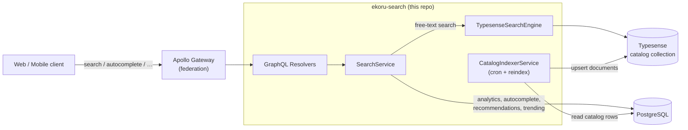

# Ekoru Search

The **search subgraph** of the Ekoru marketplace. It's a NestJS + Apollo Federation
GraphQL service that powers the `search`, `autocomplete`, `recommendations` and
`trending` features across the platform's three catalogs: **marketplace products**
(second‑hand items), **store products** (upcycled / new items sold by businesses) and
**services**.

Free‑text search is served by **[Typesense](https://typesense.org/)** — a fast,
typo‑tolerant search engine — while a legacy PostgreSQL full‑text path is kept behind a
feature flag for rollback. Analytics (search logs, clicks, views, trending) live in
PostgreSQL via Prisma.

---

## 🧸 Explain it like I'm five ("for dummies")

> Imagine Ekoru is a huge second‑hand shop with three departments: used goods, an
> upcycle store, and services (plumbers, tailors…). This service is the **shop
> assistant** you ask "where are the red bikes?".
>
> - The assistant doesn't run around the warehouse (the database) every time you ask.
>   Instead, once in a while a **helper (the "indexer")** walks the warehouse, writes a
>   neat index card for every item, and files them all in a **super‑fast card catalog
>   (Typesense)**.
> - When you search, the assistant flips through the card catalog — not the warehouse —
>   so it answers in a few milliseconds, **even if you spell it wrong** ("bicicleta" vs
>   "bicecleta" still works).
> - The assistant only shows you cards for **your country and your language**, and never
>   shows you your *own* items for sale.
> - Every question you ask is quietly written in a **notebook (PostgreSQL analytics
>   tables)** so Ekoru learns what's popular and what's trending.
>
> That's the whole thing: a helper copies the warehouse into a fast card catalog, and the
> assistant searches the cards. The rest of this documentation explains how each piece
> works.

---

## 📚 Documentation

Start here, then dive into whatever you need. Every doc is under [`docs/`](docs/) and
includes diagrams.

| Doc | What it answers |
|-----|-----------------|
| **[Architecture](docs/architecture.md)** | How the repo works: modules, the request lifecycle, folder layout, federation, cron jobs, health & metrics. |
| **[Typesense](docs/typesense.md)** | What Typesense is, the `catalog` collection schema, how a query is built (fields, weights, filters, facets, typo tolerance), and the swappable engine "port". |
| **[Database & Indexing](docs/database.md)** | How the service is linked to PostgreSQL: the tables it *owns* (analytics) vs the catalog tables it *reads*, and the pipeline that copies the DB into Typesense. |
| **[Search Flow](docs/search-flow.md)** | How a search is actually done, end to end — country/language scoping, filtering, sorting, pagination, and the Postgres fallback. Also autocomplete, recommendations, trending. |
| **[Configuration (.env)](docs/configuration.md)** | Every environment variable, what reads it, its default, and dev/staging/prod examples. |
| **[Extending](docs/extending.md)** | Recipes: how to add a new field, a new language, a new filter, a new sort option, or a whole new catalog type — where to change what. |
| **[Features & GraphQL API](docs/features.md)** | The full feature list and a reference for every query, mutation, input and response type. |

---

## 🚀 Quick start (local dev)

```bash
# 1. Install dependencies
npm install

# 2. Generate the Prisma client
npm run prisma:gen

# 3. Start Typesense (Docker) — listens on localhost:8108 with key "dev-typesense-key"
docker compose up -d

# 4. Create a .env  (see docs/configuration.md for the full list)
#    At minimum: DATABASE_URL, SEARCH_ENGINE=typesense, TYPESENSE_* , COUNTRY_LANGUAGE_MAP

# 5. Build once, then fill the Typesense catalog from the database
npm run reindex

# 6. Run the service (GraphQL Playground at http://localhost:4006/graphql)
npm run start:dev
```

> **First‑run gotcha:** the live `search` query reads Typesense but never *creates* the
> collection. Until you run `npm run reindex` (or the 5‑minute sync cron fires), searches
> return empty. See [docs/database.md](docs/database.md#operations--reindex) for the full
> reindex runbook.

---

## 🧱 Tech stack

| Layer | Choice |
|-------|--------|
| Runtime | Node.js ≥ 22.14 |
| Framework | NestJS 11 |
| API | GraphQL via Apollo Federation v2 (`@nestjs/apollo`) |
| Search engine | Typesense 2.x client → Typesense 27.x server |
| Database | PostgreSQL (shared with the rest of Ekoru) |
| ORM | Prisma 7 (with the `@prisma/adapter-pg` driver adapter) |
| Scheduling | `@nestjs/schedule` (cron jobs) |
| Metrics | Prometheus (`/metrics`) |
| Language | TypeScript 5.7 |

---

## 🗺️ 10,000‑ft view



- **Read path** (a search): client → gateway → `SearchService` → Typesense → results.
- **Write path** (keeping the index fresh): `CatalogIndexerService` reads catalog rows
  from PostgreSQL and upserts them into Typesense, on a full reindex and every 5 minutes.

For the details behind each arrow, read [docs/architecture.md](docs/architecture.md).

---

## 📁 Project structure

```
src/
├── main.ts                     # Bootstraps the Nest app (port, CORS, validation)
├── app.module.ts               # Root module: GraphQL federation, config, schedule, metrics
├── config/configuration.ts     # Reads env vars into typed config
├── health/health.controller.ts # GET /health (pings Typesense)
├── prisma/                     # Prisma client (PostgreSQL driver adapter)
├── graphql/                    # Shared scalars & enums (incl. Language)
├── common/                     # Utils, decorators, exception filters
├── scripts/reindex.ts          # `npm run reindex` — one-shot full reindex
└── search/
    ├── search.module.ts        # Wires the search feature together
    ├── search.resolver.ts      # search / reindexCatalog / autocomplete / recommendations / trending / track*
    ├── search.service.ts       # Orchestration: routes to Typesense or Postgres; analytics
    ├── search-result.resolver.ts  # Federation refs on each hit (product/storeProduct/service/seller)
    ├── dto/search.input.ts     # GraphQL input types (SearchInput, …)
    ├── entities/               # GraphQL response types + federation stubs
    ├── engine/                 # SearchEngine port + Typesense adapter
    ├── indexer/                # DB → Typesense indexer + locale config
    ├── strategies/             # Legacy PostgreSQL full-text strategy (fallback)
    └── services/trending.service.ts  # Cron jobs for trending/analytics upkeep

prisma/schema.prisma            # Analytics tables this service OWNS (auto-generated from root)
docker-compose.yml              # Local Typesense node
```

---

## 🔧 Common commands

| Command | What it does |
|---------|--------------|
| `npm run start:dev` | Run in watch mode |
| `npm run build` | Compile to `dist/` |
| `npm run reindex` | Build, then rebuild the whole Typesense catalog from the DB |
| `npm run reindex:prod` | Reindex without rebuilding (for the prod image) |
| `npm run prisma:gen` | Generate the Prisma client |
| `npm test` | Run unit tests |
| `npm run lint` | Lint & auto-fix |

---

## 🩺 Health & metrics

- `GET /health` → `{ "status": "ok", "typesense": "ok" | "unavailable" }`
- `GET /metrics` → Prometheus metrics
- `GET|POST /graphql` → the GraphQL endpoint (Playground enabled when `NODE_ENV !== production`)

---

_Maintained by the Ekoru search team. When you change how search works, update the doc in
[`docs/`](docs/) that covers it — the diagrams are the contract._
