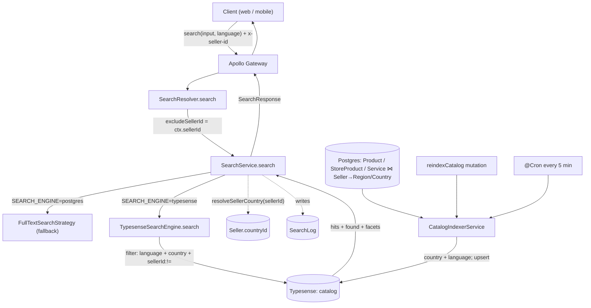

# Typesense Search (as-built)

> Status: implemented 2026-06. Companion to `docs/SEARCH_SCALABILITY_PLAN.md` (the
> original design rationale). This is the **as-built reference**: what changed, how it
> works, how to deploy it, and what is still missing.

## 1. Summary

The `search` query is served by **Typesense** (typo-tolerant), behind the **unchanged
GraphQL contract**. The legacy PostgreSQL full-text path is kept and selectable for
rollback. Key behaviour:

- **One `catalog` collection.** Every item carries `country` + `language` fields. Scoping is
  done with filters, not separate collections — so a bilingual market (Canada: `en` + `fr`)
  lives in one place.
- **Results are scoped by country + language.** A query always filters by the selected
  `language`; for an authenticated user it also filters by **their own account country**
  (all transactions are country-local). Guests have no country → language-only.
- **`language` is a GraphQL arg** (like the other subgraphs); **country is never a client
  arg** — it's derived server-side from the `x-seller-id` identity.
- **Seller exclusion**: the caller's own listings are excluded (`sellerId:!=`).
- **Flag-guarded**: `SEARCH_ENGINE=typesense` (default) or `postgres` (rollback).
- Autocomplete / recommendations / trending are unchanged (still Postgres); the broken
  in-flow "suggestion generation" was removed from `search`.

## 2. Architecture

```
GraphQL  search(input, language)  ─►  SearchService
                                        │  SEARCH_ENGINE=typesense → SearchEngine port (default)
                                        │  SEARCH_ENGINE=postgres  → FullTextSearchStrategy (rollback)
                                        ▼
                                  TypesenseSearchEngine ─► Typesense (Docker)
                                                            single collection: catalog
CatalogIndexerService ── raw SQL (items + seller→country/region) ──► upsert into catalog
   • reindexAll()       admin mutation + manual run (full load)
   • syncIncremental()  @Cron every 5 min (changed-since window, drops deactivated)
```

The engine sits behind a **swappable `SearchEngine` port**, so Typesense can be replaced
(Cloud, OpenSearch, …) without touching the GraphQL layer.

## 3. Key domain facts (shape the design)

- **Country-local.** No international shipping/transactions — a user only ever sees items
  from their own country. For authenticated users the country comes from their **account**
  (never a client arg). Guests pass a `country` ISO code (from the web app's country selector
  / the mobile app), resolved to a `Country.id` via the new `Country.code` column; guests who
  send no country are unscoped (language-only).
- **Content is single-language per item**, derived from the seller's country/region at index
  time (Québec region → `fr`; otherwise the country's language). Canada is **bilingual**: a
  Toronto seller's items are `en`, a Québec seller's are `fr`; a Canadian buyer who selects
  `fr` sees `fr` items, `en` sees `en`.
- The search subgraph shares the Postgres DB and reads `Product`/`StoreProduct`/`Service`
  (+ `Seller`→`Region`) via raw SQL; its own Prisma schema only has `Search*` analytics
  models.

## 4. Files

### Added
| File | Purpose |
|------|---------|
| `docker-compose.yml` | Local-dev Typesense (localhost defaults). |
| `typesense.staging.yml`, `typesense.prod.yml` | Standalone server Typesense stacks (see §6). |
| `src/search/engine/search-engine.interface.ts` | `SearchEngine` port, `SEARCH_ENGINE` token, `CatalogDocument`. |
| `src/search/engine/typesense.engine.ts` | Typesense adapter (collection schema, query/filter/sort/facet mapping, health). |
| `src/search/indexer/locale.config.ts` | `languageFilter` (query), `languageFromSeller` (index), `CATALOG_COLLECTION`. |
| `src/search/indexer/catalog-indexer.service.ts` | Full reindex + `@Cron` incremental sync. |
| `src/scripts/reindex.ts` | `npm run reindex` one-shot full load (dev). |
| `src/search/engine/typesense.engine.spec.ts`, `src/search/indexer/locale.config.spec.ts` | Unit tests. |

### Modified
| File | Change |
|------|--------|
| `src/search/search.service.ts` | Branches engine vs Postgres; `searchViaEngine` derives country from the seller account (`resolveSellerCountry`) and passes `language`+`country`; removed in-flow suggestion generation. |
| `src/search/search.resolver.ts` | `language` arg on `search`; admin `reindexCatalog` mutation; passes `excludeSellerId` from `ctx.sellerId`. |
| `src/search/search.module.ts` | Registers `TypesenseSearchEngine`, binds `SEARCH_ENGINE`, provides `CatalogIndexerService`. |
| `src/graphql/enums/index.ts` | Local `Language` enum (ES/EN/FR/PT/DE) + `registerEnumType`. |
| `src/config/configuration.ts`, `.env` | `searchEngine` + `typesense.*` config. |
| `src/health/health.controller.ts` | Adds a Typesense liveness ping to `GET /health`. |
| `package.json` | `typesense` dep + `reindex` script. |

## 5. How it works

### 5.1 Query flow (`search`)
1. `SearchResolver.search(input, language=ES, ctx)` →
   `SearchService.search({ input, language, excludeSellerId: ctx.sellerId, … })`.
2. `SearchService` checks `SEARCH_ENGINE`: default → `searchViaEngine`; `postgres` → legacy.
3. `searchViaEngine`:
   - `language` filter value = `languageFilter(language)` (`ES→'es'`, …).
   - `country`: authenticated → `resolveSellerCountry(excludeSellerId)` (account); guest →
     `resolveCountryIdFromCode(country)` (ISO code → `Country.id`); else `undefined`.
   - calls `engine.search({ input, language, country, excludeSellerId })`.
4. `TypesenseSearchEngine.search` issues one Typesense query → maps hits to
   `SearchResultItem[]`, `found` (total), `facet_counts` → `SearchFacets`.
5. The search is logged (`SearchLog`); `suggestions` is always `[]`.

### 5.2 Typesense query mapping
- `q` = query (empty → `*`, browse all); `query_by` = `name^5,brand^3,category^3,tags^2,description`.
- `filter_by` always includes `language:=<selected>`, plus:
  - `country:=<acct country>` when known (guests: omitted),
  - `sellerId:!=<caller>` (own-listing exclusion),
  - `type` (`PRODUCTS`→`[PRODUCT,STORE_PRODUCT]`, `SERVICES`→`SERVICE`), `price`, `hasOffer`,
    `rating`, `category`, `tags`.
- `sort_by` from `SearchSortBy`; `facet_by` = `type,category,tags`; typo tolerance = defaults.

### 5.3 Collection & fields
Single collection `catalog`. Searchable: `name,brand,category,tags,description`. Filter/facet:
`type,country,language,sellerId,hasOffer,price,rating,category,tags`. `createdAt` is the
default sort field. Doc id is namespaced: `product_<id>` | `store_<id>` | `service_<id>`.

### 5.4 Indexing & sync
- `reindexAll()` — `ensureCollections()` then upserts every active item. Run via the admin
  `reindexCatalog` mutation or `npm run reindex` (dev).
- `syncIncremental()` — `@Cron` every 5 min: re-reads everything changed in the last ~11 min
  (`SYNC_WINDOW_MS`, > 2× interval) and upserts; deletes items deactivated/soft-deleted in
  that window. Idempotent upserts + overlap ⇒ **no persisted cursor / no extra migration**.
- Each doc's `country` = seller's `countryId`; `language` = `languageFromSeller(country,
  region)` (Québec → `fr`; else `COUNTRY_LANGUAGE_MAP`; else `es`).

## 6. Configuration

| Env | Where | Default | Meaning |
|-----|-------|---------|---------|
| `SEARCH_ENGINE` | app | `typesense` | `typesense` or `postgres` (rollback). |
| `TYPESENSE_HOST` | app | `localhost` | Typesense host / container name. |
| `TYPESENSE_PORT` | app | `8108` | Port. |
| `TYPESENSE_PROTOCOL` | app | `http` | `http` / `https`. |
| `TYPESENSE_API_KEY` | app **and** Typesense | `dev-typesense-key` | Shared secret — **must match** on both sides. |
| `TYPESENSE_TIMEOUT` | app | `5` | Client connection timeout (seconds). |
| `COUNTRY_LANGUAGE_MAP` | app | _(empty)_ | `"<countryId>:<lang>,…"`, e.g. `1:es,2:en,5:fr`. Sets each item's content language at index time (Québec region → `fr` regardless). |

## 7. Deployment

### Local dev
```bash
docker compose -f docker-compose.yml up -d typesense   # localhost:8108, key dev-typesense-key
# set SEARCH_ENGINE=typesense + TYPESENSE_* in .env, then:
npm run reindex
# GraphQL: search(input:{query:"camion"}, language: ES) { items { id name } pageInfo { totalItems } }
curl localhost:<PORT>/health   # { "status": "ok", "typesense": "ok" }
```

### Server (staging / prod) — Typesense is a **standalone, long-lived stack**
Kept out of `compose.*.yml` so app deploys (`docker compose ... up -d --force-recreate`)
never restart the search engine. App ↔ Typesense talk over the shared external network the
app already uses (`ekoru-network` prod / `ekoru-staging-network` staging); **no host port**.

1. **Bring Typesense up once per server** (the network must already exist):
   ```bash
   docker network inspect ekoru-network >/dev/null 2>&1 || docker network create ekoru-network
   printf 'TYPESENSE_API_KEY=%s\n' "$(openssl rand -hex 32)" > .env.typesense.prod
   docker compose -f typesense.prod.yml up -d        # or typesense.staging.yml
   ```
   Container name: `ekoru-typesense` (prod) / `ekoru-typesense-staging` (staging); data in
   the `typesense-*-data` volume.

2. **Point the app at it** in `/opt/ekoru/secrets/ekoru-search/.env.{staging,prod}`:
   ```
   SEARCH_ENGINE=typesense
   TYPESENSE_HOST=ekoru-typesense            # ekoru-typesense-staging on staging
   TYPESENSE_PORT=8108
   TYPESENSE_PROTOCOL=http
   TYPESENSE_API_KEY=<same key as .env.typesense.*>
   COUNTRY_LANGUAGE_MAP=1:es,2:en            # your real country ids (Québec→fr is automatic)
   ```
   The app deploys normally through Jenkins; no Typesense changes in the pipeline.

3. **Initial index load.** The prod image has no devDependencies, so `npm run reindex`
   (ts-node) is unavailable. Trigger the load via the GraphQL mutation once after the first
   deploy: `mutation { reindexCatalog }` with header `x-admin-id: <admin>`. The `@Cron` keeps
   it synced afterwards.

## 8. GraphQL surface

- `query search(input: SearchInput!, language: Language = ES, country: String, userId, sessionId): SearchResponse`
  — language-scoped and country-scoped, typo-tolerant; excludes the caller's own listings.
  `country` is an ISO code (e.g. `"CL"`) used **only for guests**; authenticated users are
  scoped by their account country and the arg is ignored. Sent as an arg (not a header) so
  web and mobile use the same mechanism.
- `mutation reindexCatalog: Int` — **admin only** (`x-admin-id`); returns documents indexed.
- Unchanged: `autocomplete`, `recommendations`, `trending`, `trackSearchClick`, `trackItemView`.

## 9. End-to-end flow

### Read path (query → results)
```
 Client (web / mobile)
   │  search(input, language)     headers: x-seller-id
   ▼
 Apollo Gateway (federation) ── routes `search`, forwards headers ─► ekoru-search
   ▼
 SearchResolver.search(input, language=ES, ctx)
   │  excludeSellerId = ctx.sellerId
   ▼
 SearchService.search()
   │  SEARCH_ENGINE=postgres  ─► FullTextSearchStrategy   (legacy, rollback)
   │  SEARCH_ENGINE=typesense (default)
   │     language = languageFilter(language)          ('es' | 'en' | 'fr')
   │     country  = resolveSellerCountry(sellerId)    (account country; guests → none)
   ▼
 TypesenseSearchEngine.search()
   │  q + query_by(name^5,brand^3,category^3,tags^2,description)
   │  filter_by: language:=<sel>  [+ country:=<acct>]  + sellerId:!=<me>
   │             + type / price / hasOffer / rating / category / tags
   ▼
 ┌──────────────── Typesense ────────────────┐
 │      catalog  (filtered by country+lang)   │
 └─────────────────────────────────────────────┘
   │  hits + found + facet_counts
   ▼
 SearchService → SearchResponse { items[], pageInfo(totalItems=found), facets }   (+ SearchLog)
   ▼
 Apollo Gateway ─►  Client      ✦ final results
```

### Write path (DB → index)
```
 Postgres  Product / StoreProduct / Service   ⋈  Seller → Region / Country
   │  raw SQL (CatalogIndexerService)
   ▼
 country  = seller.countryId
 language = languageFromSeller(country, region)        (Québec→fr; else country map; else es)
 doc id   = product_<id> | store_<id> | service_<id>
   │  engine.indexDocuments(docs)   [upsert]
   ▼
 Typesense  catalog
   ▲
   ├─ reindexAll()       ← admin `reindexCatalog` / `npm run reindex`  (full load)
   └─ syncIncremental()  ← @Cron every 5 min  (changed-since window; evicts deactivated)
```

### As a graph (Mermaid)


## 10. What's missing / follow-ups

**Needed for production**
- **`Country.code` migration.** The guest `country` arg is resolved via the new
  `Country.code` column (root schema). Run the migration and **backfill ISO codes**
  (`CL`, `CA`, …) — until then `resolveCountryIdFromCode` returns nothing and guest scoping
  is a no-op (language-only).
- **Guest country UX.** Guests pick their country in the web app selector (cookie-persisted)
  and it's sent as the `country` arg; mobile sends it directly. Optional improvement: auto-detect
  the guest's country (geo-IP) to pre-fill the selector instead of defaulting to `CL`.
- **Locale onboarding.** Until `COUNTRY_LANGUAGE_MAP` (or the Québec rule) is set, every item
  is indexed as `es`, so `language: EN/FR` return nothing. Configure it with real country ids,
  then re-run `reindexCatalog`.
- **Hard-deleted services** aren't evicted incrementally (they vanish from SQL); they clear on
  the next full `reindexAll()`. Products/store-products soft-delete and are handled.
- **Event-driven sync (BullMQ)** instead of cron, for near-real-time freshness (plan Phase 5).

**Known gaps**
- `categories`/`tags` filters are applied on the Typesense path but still ignored on the
  Postgres fallback.
- Single tokenizer for all languages (one collection) — fine for ES/EN/FR (Latin) with typo
  tolerance, but no per-language stemming. Revisit if stemming/accent-folding is needed.
- Typesense schema changes require a reindex (create new collection, reindex, swap) — not yet
  automated (alias/zero-downtime flip).
- `terraform/` does not yet capture the Typesense service (compose only).

**Testing**
- Full `search` suite is green (`search.spec.ts`, `typesense.engine.spec.ts`,
  `locale.config.spec.ts`). Run with `npm test` (or `npx jest`).
