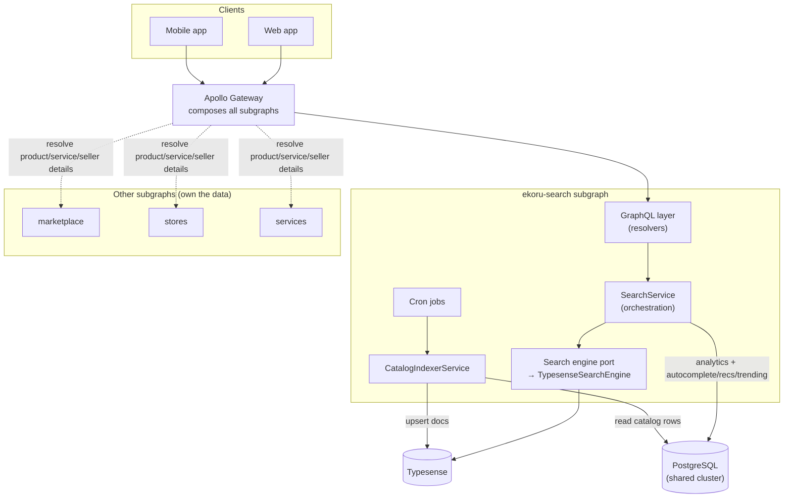
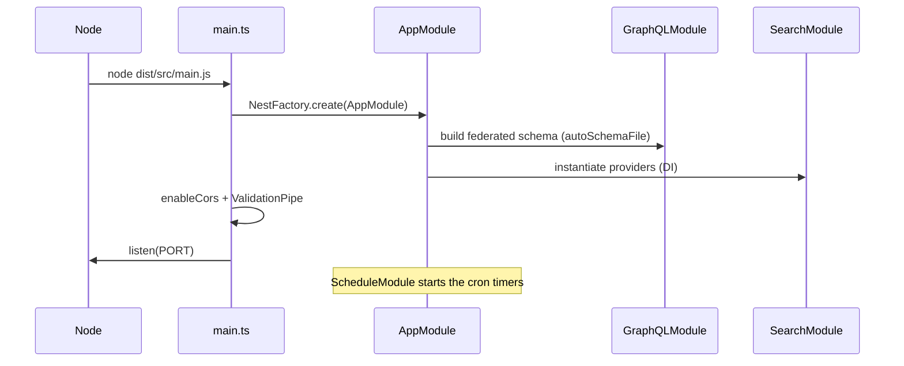
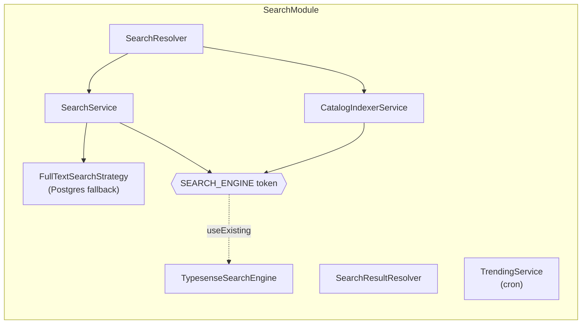
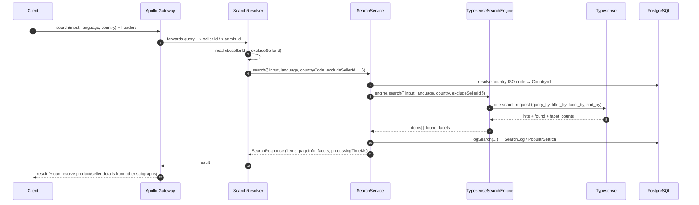
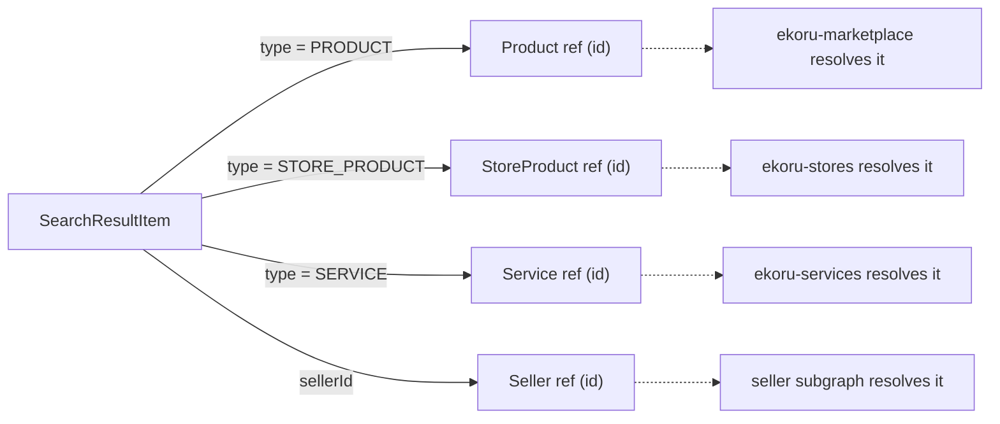

# Architecture — how the repo works

> **For dummies:** This service is a small web server. It speaks GraphQL (a query
> language), it keeps a fast search index (Typesense) up to date from the main database,
> and it answers search questions. Nest is the framework that glues everything together
> with "modules" and "dependency injection" — think of it as a box of Lego where each
> brick (a service, a resolver) declares what other bricks it needs and Nest snaps them
> together at startup.

- [The big picture](#the-big-picture)
- [Startup: what boots and in what order](#startup-what-boots-and-in-what-order)
- [Modules](#modules)
- [The request lifecycle](#the-request-lifecycle)
- [Federation: this is a subgraph](#federation-this-is-a-subgraph)
- [Authentication & identity](#authentication--identity)
- [Background jobs (cron)](#background-jobs-cron)
- [Health & metrics](#health--metrics)
- [Folder layout](#folder-layout)
- [Design principles](#design-principles)

---

## The big picture

`ekoru-search` is **one microservice** among several that together form the Ekoru
GraphQL API. It does not own the product/service data — it *reads* it, copies it into a
search index, and answers search queries against that index.



Two flows matter:

1. **Read (answering a search)** — `GraphQL → SearchService → Typesense → results`.
   Fast, because it hits the pre‑built index, not the live tables.
2. **Write (keeping the index fresh)** — `CatalogIndexerService → read PostgreSQL →
   upsert into Typesense`. Runs on a full reindex and every 5 minutes.

---

## Startup: what boots and in what order

[`src/main.ts`](../src/main.ts) is the entry point. It:

1. Creates the Nest application from [`AppModule`](../src/app.module.ts).
2. Enables **CORS** (`app.enableCors()` — currently open to all origins).
3. Installs a global **`ValidationPipe`** (`whitelist`, `forbidNonWhitelisted`,
   `transform`) so incoming GraphQL inputs are validated and stripped of unknown fields.
4. Reads `PORT` (default **4006** in deployments, `4005` as the code fallback) and starts
   listening.



---

## Modules

Nest organizes code into **modules**. [`AppModule`](../src/app.module.ts) is the root and
imports everything:

| Module | Responsibility |
|--------|----------------|
| `PrometheusModule` | Exposes `GET /metrics` with default Node/process metrics. |
| `ConfigModule` | Loads [`configuration.ts`](../src/config/configuration.ts) globally, so any provider can inject typed config. See [configuration.md](configuration.md). |
| `ScheduleModule` | Enables `@Cron(...)` decorators (the background jobs). |
| `GraphQLModule` | Apollo **Federation v2** driver. Builds the schema by code‑first introspection (`autoSchemaFile`), sets up the request `context`, enables Playground outside production, and strips exception details from errors in production. |
| `PrismaModule` | Provides the `PrismaService` (PostgreSQL client). |
| `SearchModule` | The feature module — all search logic. |

### SearchModule wiring

[`SearchModule`](../src/search/search.module.ts) is where the search feature's pieces are
registered and connected:



The important trick: `SEARCH_ENGINE` is a **DI token** (a `Symbol`) bound to
`TypesenseSearchEngine`. Everything that searches or indexes depends on the *token*, not
the concrete class — so the engine can be swapped without touching callers. See
[typesense.md → the engine port](typesense.md#the-engine-port-swappability).

---

## The request lifecycle

What happens when a `search` query arrives:



The GraphQL layer only handles transport and validation; all decisions live in
`SearchService` and the engine. Full detail in [search-flow.md](search-flow.md).

---

## Federation: this is a subgraph

This service is an **Apollo Federation v2 subgraph**. It publishes a slice of the overall
GraphQL schema; the **gateway** stitches it together with the other subgraphs
(marketplace, stores, services) into one API the clients call.

Search results are deliberately **thin** — the index only holds what ranking and the
result card need. For anything richer (a product's condition/badges, a store product's
stock/warranty, a seller's profile), each hit carries a **typed federation reference**:



These refs are defined in
[`entities/catalog-refs.entity.ts`](../src/search/entities/catalog-refs.entity.ts) with
`@key(fields: "id", resolvable: false)` — meaning *this* subgraph only hands the gateway a
key; the owning subgraph does the actual lookup, and only for the fields the client asked
for. [`SearchResultResolver`](../src/search/search-result.resolver.ts) attaches the right
ref to each hit based on its `type`.

**Why this matters:** a store product's stock can change every second, but we never have
to reindex Typesense for it — the client just follows the reference to the live value.

---

## Authentication & identity

This subgraph **does not verify tokens itself**. The gateway authenticates the caller and
forwards identity as HTTP headers, which [`AppModule`](../src/app.module.ts) turns into the
GraphQL `context`:

| Header | Context field | Used for |
|--------|---------------|----------|
| `x-seller-id` | `ctx.sellerId` | Excluding the caller's **own listings** from their search results. |
| `x-admin-id` | `ctx.adminId` | Gating the admin‑only `reindexCatalog` mutation. |
| `authorization` | `ctx.token` | Available in context; not currently consumed by search logic. |

So identity here answers two narrow questions ("whose items do I hide?" and "are you an
admin?") — it does **not** decide the market. Country and language are explicit client
arguments (see [search-flow.md](search-flow.md#country--language-scoping)).

---

## Background jobs (cron)

`ScheduleModule` runs these `@Cron` jobs in‑process:

| Job | Schedule | File | Purpose |
|-----|----------|------|---------|
| `syncIncremental` | every 5 min | [catalog-indexer.service.ts](../src/search/indexer/catalog-indexer.service.ts) | Upsert catalog rows changed in the last ~11 min into Typesense; evict deactivated ones. |
| `updateTrendingScores` | every hour | [trending.service.ts](../src/search/services/trending.service.ts) | Recompute `PopularSearch.trendingScore`. |
| `cleanupOldSearchLogs` | daily @ 00:00 | trending.service.ts | Delete `SearchLog` rows older than 3 months. |
| `updateSearchSuggestions` | daily @ 01:00 | trending.service.ts | Refresh the `SearchSuggestion` table from recent successful searches. |
| `deactivateUnpopularSuggestions` | weekly | trending.service.ts | Turn off suggestions not updated in 2 weeks. |

> ⚠️ These run in **every** instance. If you scale to multiple replicas, the same cron
> fires in each — fine for idempotent upserts, but something to be aware of for the
> analytics jobs. See [database.md → operations](database.md#operations--reindex).

---

## Health & metrics

- **`GET /health`** — [`HealthController`](../src/health/health.controller.ts) pings
  Typesense and returns `{ status: "ok", typesense: "ok" | "unavailable" }`. Use it as a
  liveness/readiness probe.
- **`GET /metrics`** — Prometheus metrics (process + default Node metrics).

---

## Folder layout

```
src/
├── main.ts                       # Entry point (bootstrap)
├── app.module.ts                 # Root module
├── config/
│   └── configuration.ts          # env → typed config
├── graphql/
│   ├── enums/                    # Language, ServicePricing, SortOrder, …
│   └── scalars/                  # DateTime, JSON scalars
├── common/
│   ├── decorators/               # e.g. @CurrentSeller
│   ├── exceptions/               # GraphQL exception helpers
│   └── utils/                    # pagination helpers
├── prisma/
│   ├── prisma.module.ts
│   └── prisma.service.ts         # PostgreSQL client (adapter-pg)
├── health/
│   └── health.controller.ts      # GET /health
├── scripts/
│   └── reindex.ts                # `npm run reindex`
└── search/
    ├── search.module.ts
    ├── search.resolver.ts        # entry queries/mutations
    ├── search.service.ts         # orchestration + analytics
    ├── search-result.resolver.ts # federation refs per hit
    ├── dto/
    │   └── search.input.ts       # input types + SearchType/SearchSortBy enums
    ├── entities/
    │   ├── search-result.entity.ts   # response types + SearchResultType
    │   └── catalog-refs.entity.ts    # federation stubs
    ├── engine/
    │   ├── search-engine.interface.ts  # the port + CatalogDocument
    │   └── typesense.engine.ts         # Typesense adapter
    ├── indexer/
    │   ├── catalog-indexer.service.ts  # DB → Typesense
    │   └── locale.config.ts            # language/collection config
    ├── strategies/
    │   └── fulltext-search.strategy.ts # legacy Postgres FTS
    └── services/
        └── trending.service.ts         # cron jobs
```

---

## Design principles

- **The index is a projection, not the source of truth.** PostgreSQL owns the data;
  Typesense is a disposable, rebuildable copy. Anything not needed for ranking or the
  result card is fetched live via federation.
- **Swappable engine.** Search/index code depends on the `SearchEngine` interface, so
  Typesense could be replaced (Typesense Cloud, OpenSearch, …) by writing one adapter.
- **Feature‑flagged rollback.** `SEARCH_ENGINE=postgres` reverts the `search` query to the
  legacy full‑text strategy without a redeploy of new code.
- **Idempotent, cursor‑free sync.** The 5‑minute sync re‑reads an overlapping window and
  upserts, so it needs no persisted "last run" position and no extra migration.
- **Contract stability.** The GraphQL surface stays the same regardless of which engine
  serves it.

---

**Next:** [How Typesense works →](typesense.md)
