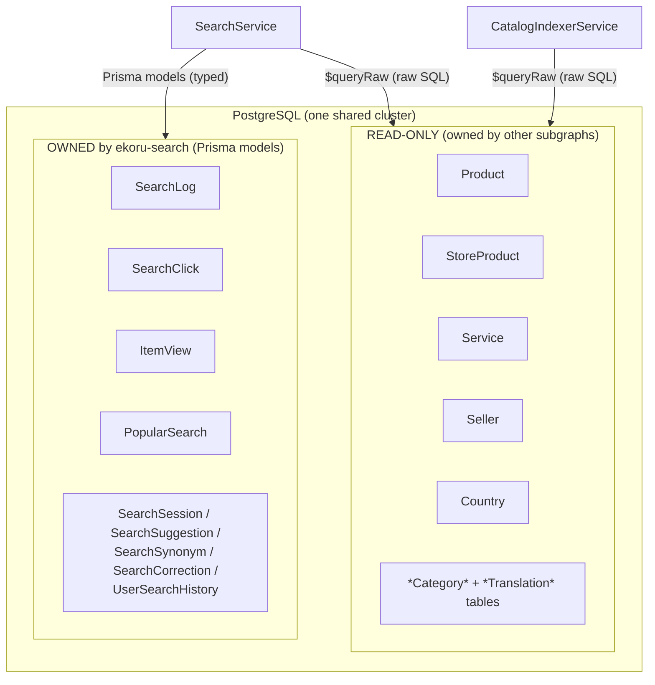
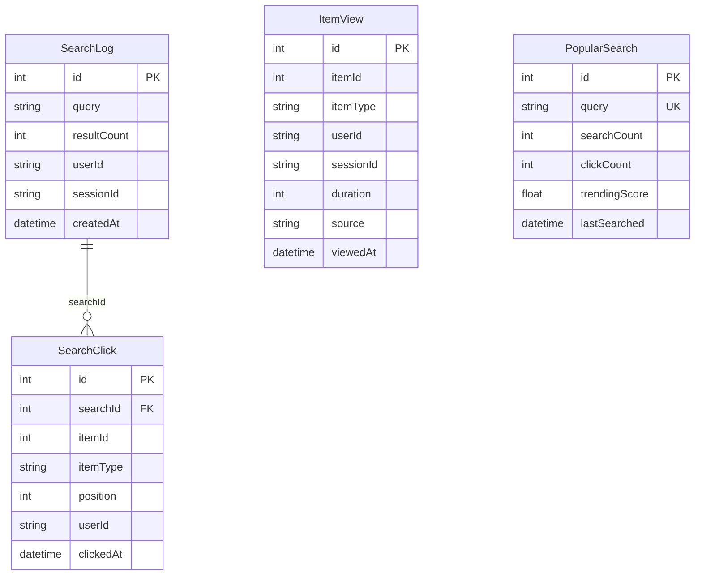
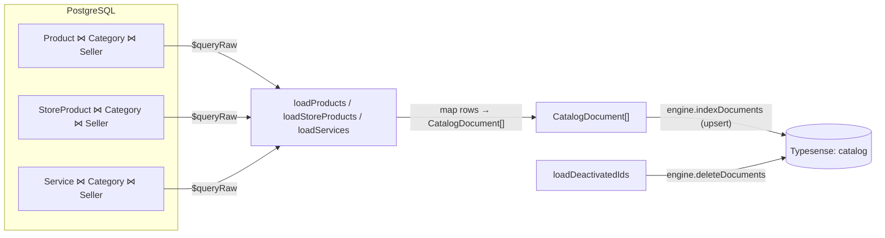
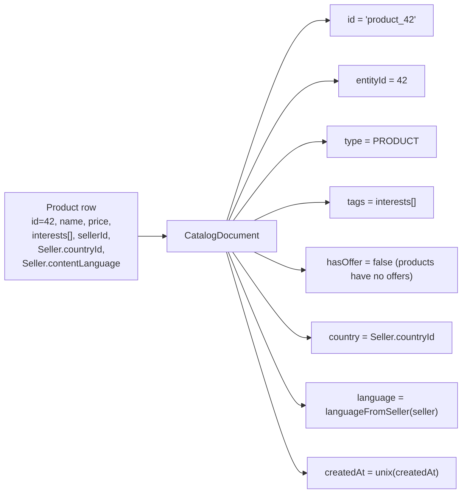
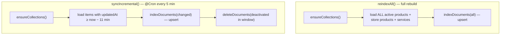
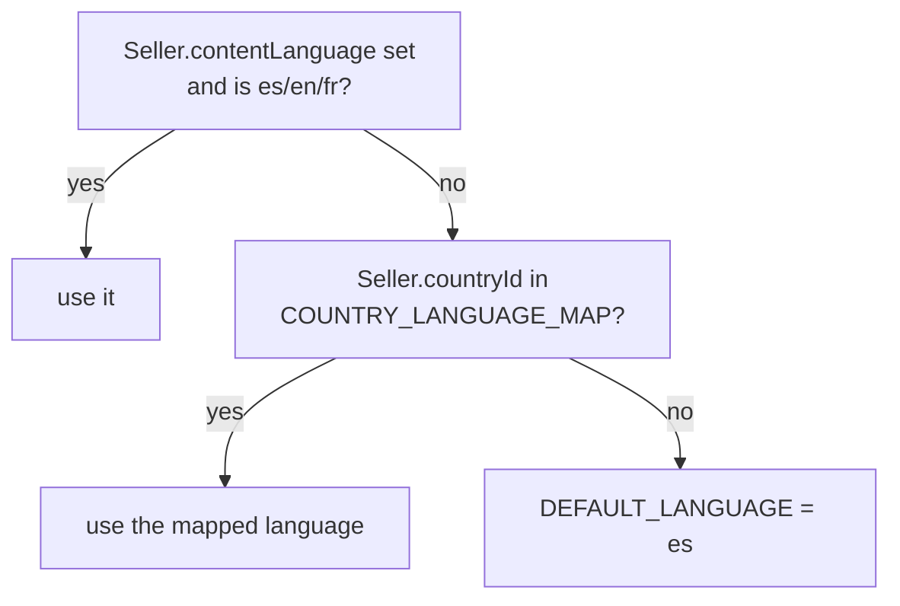

# Database & Indexing — how it's linked to PostgreSQL

> **For dummies:** There's one big PostgreSQL database shared by all the Ekoru services.
> This search service has a split relationship with it:
> - It **owns** a handful of small "analytics" tables (search logs, clicks, views…) and
>   reads/writes them normally through Prisma.
> - It **borrows** the big catalog tables (products, services, sellers…) that *other*
>   services own — it only reads them, with hand‑written SQL, to copy them into Typesense.
>
> The "indexer" is the copy machine: it reads catalog rows and writes Typesense documents,
> once in a full rebuild and again every 5 minutes for whatever changed.

- [Two planes: owned vs borrowed](#two-planes-owned-vs-borrowed)
- [How the connection is made (Prisma + adapter-pg)](#how-the-connection-is-made-prisma--adapter-pg)
- [The tables this service owns](#the-tables-this-service-owns)
- [The catalog tables it reads](#the-catalog-tables-it-reads)
- [The indexing pipeline](#the-indexing-pipeline)
- [From a row to a document](#from-a-row-to-a-document)
- [Full reindex vs incremental sync](#full-reindex-vs-incremental-sync)
- [Language & country derivation](#language--country-derivation)
- [Operations & reindex](#operations--reindex)

---

## Two planes: owned vs borrowed



Why the split? This service must not *own* another team's tables (that would couple their
migrations to ours). So its Prisma schema declares **only** the analytics tables; the
catalog tables are reached with `prisma.$queryRaw` — raw SQL against the same physical
database. The trade‑off: raw SQL is not type‑checked against those tables, so a column
rename upstream can break a query (a known coupling, noted in
[extending.md](extending.md#a-note-on-shared-db-coupling)).

---

## How the connection is made (Prisma + adapter-pg)

[`PrismaService`](../src/prisma/prisma.service.ts) extends `PrismaClient` and connects
using the **`@prisma/adapter-pg` driver adapter** over the `pg` connection pool:

```ts
const adapter = new PrismaPg({ connectionString: process.env.DATABASE_URL });
super({ adapter });
```

It connects on module init and disconnects on shutdown. The single `DATABASE_URL`
(see [configuration.md](configuration.md)) points at the shared cluster — so both the
typed Prisma calls and the `$queryRaw` catalog reads go through the same connection.

---

## The tables this service owns

Declared in [`prisma/schema.prisma`](../prisma/schema.prisma). These record what users
search, click and view, and power trending/autocomplete.



| Model | Written by | Purpose |
|-------|-----------|---------|
| `SearchLog` | every `search` | One row per search (query, result count, user/session). Returns the `searchId`. |
| `SearchClick` | `trackSearchClick` | Which result was clicked, and at what position. |
| `ItemView` | *(schema present)* | Item detail views with duration/source. |
| `PopularSearch` | `search`, `trackSearchClick`, hourly cron | Aggregated per‑query counts + `trendingScore`. |
| `UserSearchHistory` | `search` (if `userId`) | Per‑user history. |
| `SearchSuggestion` | daily cron | Autocomplete term frequencies. |
| `SearchSynonym` | *(schema present)* | Query synonyms — not yet used in the query path. |
| `SearchCorrection` | *(schema present)* | Spell corrections — not yet used in the query path. |
| `SearchSession` | *(schema present)* | Session‑level search aggregation. |

> **Important:** [`prisma/schema.prisma`](../prisma/schema.prisma) is **auto‑generated**
> from a root master schema (see the banner at the top of the file). Don't edit it
> directly, and run migrations only from the root repo. This subgraph just needs the
> generated client (`npm run prisma:gen`).

---

## The catalog tables it reads

These are owned by other subgraphs but read here via `$queryRaw` to build the index and to
serve autocomplete/recommendations/trending:

| Table | Read for | Notable columns used |
|-------|----------|----------------------|
| `Product` | index, autocomplete, recs, trending | `name, description, price, images, brand, interests (→tags), productCategoryId, sellerId, isActive, deletedAt, updatedAt, viewCount` |
| `StoreProduct` | index, trending | `name, description, price, offerPrice, hasOffer, images, brand, tags, averageRating, reviewsNumber, subCategoryId, sellerId, isActive, deletedAt` |
| `Service` | index, autocomplete, recs, trending | `name, description, basePrice, images, tags, averageRating, subcategoryId, sellerId, isActive` |
| `Seller` | index (locale) | `countryId, contentLanguage` |
| `Country` | query‑time scope | `id, code` (ISO → id) |
| Category + `*Translation` tables | index (category names) | Spanish (`ES`) translations joined for `category`/`subcategory` |

Category names are **translated**; the indexer joins the `*Translation` tables filtered to
`language = 'ES'` to get the display category for each item.

---

## The indexing pipeline

[`CatalogIndexerService`](../src/search/indexer/catalog-indexer.service.ts) is the bridge
from PostgreSQL to Typesense.



Each `loadX` method runs one SQL query that joins the source table to its category
translations and to `Seller` (for locale), then maps every row into a `CatalogDocument`.

---

## From a row to a document

Here's the transformation for a product (the others are analogous):



Type‑specific mapping notes:

- **Product** — `interests` becomes `tags`; `hasOffer` is always `false` (marketplace
  items have no offer concept); category comes from `ProductCategoryTranslation` (ES).
- **StoreProduct** — carries real `offerPrice` / `hasOffer`, `averageRating` → `rating`,
  `reviewsNumber` → `reviewCount`; category + subcategory from the store translation
  tables.
- **Service** — `basePrice` → `price`; `hasOffer` always `false`; category/subcategory
  from the service translation tables.

---

## Full reindex vs incremental sync

The indexer has two entry points:



| | `reindexAll()` | `syncIncremental()` |
|-|----------------|---------------------|
| Trigger | `npm run reindex` script or `reindexCatalog` admin mutation | `@Cron` every 5 minutes |
| Scope | **all** active items | items changed in the last **~11 min** |
| Deletes | — (recreates from scratch) | evicts items deactivated/soft‑deleted in the window |
| Use when | first load, schema change, drift repair | steady‑state freshness |

**The 11‑minute window is deliberate.** It's more than 2× the 5‑minute interval, so
consecutive runs overlap. Because upserts are idempotent, re‑indexing the same item twice
is harmless — and the overlap means we never need to persist a "last run" cursor (no extra
migration). The cost is re‑reading a little more than necessary each run.

> **Edge case:** hard‑deleted *services* vanish from SQL, so the incremental sync can't
> find them to evict. They're cleared by the next full `reindexAll()`. Products and store
> products are soft‑deleted (`deletedAt`/`isActive`), so incremental eviction handles them.

---

## Language & country derivation

Every document gets a `country` and a `language`, both derived from its **seller** at index
time ([`locale.config.ts`](../src/search/indexer/locale.config.ts)):

- **`country`** = the seller's `countryId` (a `Country.id`).
- **`language`** = `languageFromSeller(seller)`, resolved in priority order:



1. The seller's explicit `contentLanguage` (set at onboarding) is the source of truth — so
   a francophone seller is `fr` no matter where they are.
2. Otherwise the seller's **country default** via the `COUNTRY_LANGUAGE_MAP` env var
   (e.g. `1:es,2:en,5:fr`).
3. Otherwise `es`.

Only **`es`, `en`, `fr`** are indexable content languages (`SUPPORTED_LANGUAGES`). Sellers
whose `contentLanguage` is something search doesn't index (e.g. `PT`, `DE`) fall through to
the country/default rules. See
[extending.md → add a language](extending.md#recipe-add-a-content-language).

> **Onboarding gotcha:** until `COUNTRY_LANGUAGE_MAP` is configured (and sellers have a
> `contentLanguage`), *every* item indexes as `es`, so `language: EN`/`FR` searches return
> nothing. Configure it, then reindex.

---

## Operations & reindex

The live `search` query reads Typesense but **never creates the collection** — only a
reindex (or the sync cron's `ensureCollections()`) does. So a freshly deployed environment
must be indexed once, or `search` returns empty.

### Local

```bash
docker compose up -d          # start Typesense on localhost:8108
npm run reindex               # builds, then full reindex from the DB
```

### Inside a running container (staging/prod)

The production image has no dev dependencies, so `ts-node` isn't available — use the
compiled script or the admin mutation:

```bash
# 1. Confirm the container actually has the Typesense env (falls back to localhost if not)
docker exec <search-container> printenv | grep -iE 'TYPESENSE|SEARCH_ENGINE|COUNTRY_LANGUAGE'

# 2. Confirm connectivity to the Typesense container
docker exec <search-container> wget -qO- http://<typesense-host>:8108/health   # → {"ok":true}

# 3. Full reindex
docker exec <search-container> node dist/src/scripts/reindex.js
# → "Reindex finished: N documents indexed."
```

Or trigger it over GraphQL (must send the `x-admin-id` header the gateway sets for an
authenticated admin):

```graphql
mutation { reindexCatalog }   # returns the number of documents indexed
```

After the initial load, the 5‑minute cron keeps the index fresh.

### Troubleshooting

| Symptom | Likely cause | Fix |
|---------|--------------|-----|
| `search` returns empty right after deploy | Collection never created | Run a reindex (above). |
| `ECONNREFUSED localhost:8108` in logs | Container missing `TYPESENSE_*` env (using defaults) | Recreate the container with the env set. |
| `column ... does not exist` on reindex | An upstream catalog migration isn't applied to this env's DB | Apply migrations to that database. |
| Reindex OK but `search` still empty | Wrong `country`/`language` args, or `COUNTRY_LANGUAGE_MAP` not set (all items `es`) | Verify the client sends both args; configure the map + reindex. |
| `/health` shows `typesense: unavailable` | Engine unreachable / wrong key | Check host/port/protocol/key; is the Typesense container up? |

---

**Next:** [How search is actually done →](search-flow.md)
