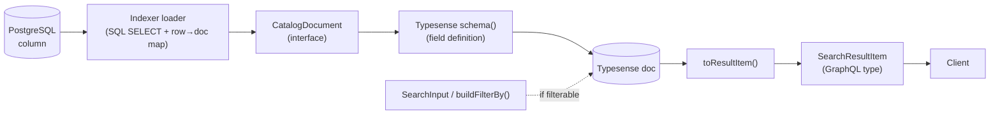
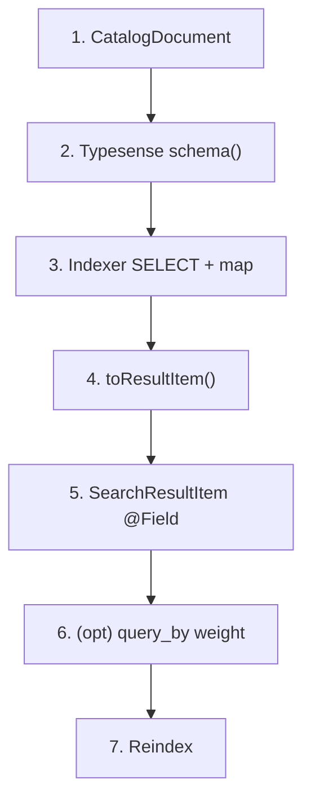
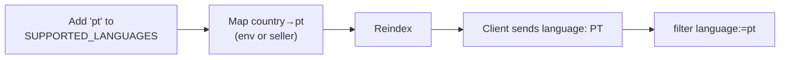
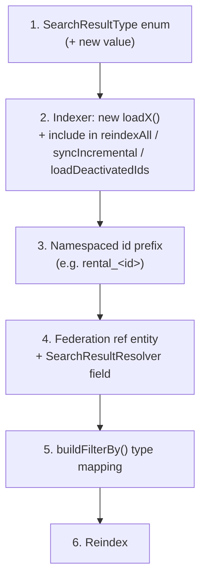
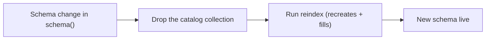

# Extending — how to add a field, language, filter, or anything else

> **For dummies:** Because the search index is a *copy* of the database, adding something
> to search almost always means changing it in **three coordinated places**: (1) the
> document shape, (2) the Typesense schema, (3) the indexer that fills it — and then
> **reindexing** so existing items pick up the change. This page gives you a checklist for
> each common change so you don't miss a spot.

- [The mental model](#the-mental-model)
- [Recipe: add a new indexed field](#recipe-add-a-new-indexed-field)
- [Recipe: add a content language](#recipe-add-a-content-language)
- [Recipe: add a search filter](#recipe-add-a-search-filter)
- [Recipe: add a sort option](#recipe-add-a-sort-option)
- [Recipe: add a facet](#recipe-add-a-facet)
- [Recipe: add a new catalog type](#recipe-add-a-new-catalog-type)
- [Recipe: swap the search engine](#recipe-swap-the-search-engine)
- [Reindexing after a schema change](#reindexing-after-a-schema-change)
- [A note on shared-DB coupling](#a-note-on-shared-db-coupling)

---

## The mental model

Data flows **left to right**. A new attribute has to be added at every hop it needs to
survive:

Ask three questions about the new thing:

1. **Does it need to be searched?** → add to `query_by`.
2. **Does it need to be filtered / faceted / sorted?** → add to schema (indexed) +
   `buildFilterBy` / `facet_by` / `buildSortBy`.
3. **Does it need to be returned to clients?** → add to `SearchResultItem` + `toResultItem`.

Then **reindex**.

---

## Recipe: add a new indexed field

Example: index a product's `condition` and return it to clients.

| # | File | Change |
|---|------|--------|
| 1 | [`engine/search-engine.interface.ts`](../src/search/engine/search-engine.interface.ts) | Add `condition?: string;` to `CatalogDocument`. |
| 2 | [`engine/typesense.engine.ts`](../src/search/engine/typesense.engine.ts) → `schema()` | Add `{ name: 'condition', type: 'string', optional: true }` to `fields`. |
| 3 | [`indexer/catalog-indexer.service.ts`](../src/search/indexer/catalog-indexer.service.ts) | In the relevant `loadX()`: `SELECT` the column in the raw SQL **and** map it in the row→doc object. |
| 4 | `engine/typesense.engine.ts` → `toResultItem()` | Map `condition: d.condition` onto the result (only if returning it). |
| 5 | [`entities/search-result.entity.ts`](../src/search/entities/search-result.entity.ts) | Add a `@Field()` `condition?: string;` to `SearchResultItem` (only if returning it). |
| 6 | *(optional)* `typesense.engine.ts` → `QUERY_BY` / `QUERY_BY_WEIGHTS` | Add `condition` + a weight if it should be **searchable**. |
| 7 | — | **Reindex** (see [below](#reindexing-after-a-schema-change)). |

> Steps 4–5 are only for *returning* the field. Steps 2–3 are always required so the value
> lands in the index. Forgetting step 3 is the classic mistake — the schema has the field
> but every document is empty.

---

## Recipe: add a content language

Example: start indexing Portuguese (`pt`) items.

| # | File / place | Change |
|---|--------------|--------|
| 1 | [`indexer/locale.config.ts`](../src/search/indexer/locale.config.ts) | Add `'pt'` to `SUPPORTED_LANGUAGES`. |
| 2 | GraphQL `Language` enum ([`graphql/enums/index.ts`](../src/graphql/enums/index.ts)) | Already has `PT`/`DE`. Ensure the value you want is present so clients can pass it. |
| 3 | `COUNTRY_LANGUAGE_MAP` env (or seller `contentLanguage`) | Map the relevant country ids to `pt`, e.g. `...,6:pt`. See [configuration.md](configuration.md#the-country_language_map-explained). |
| 4 | — | **Reindex** so existing items get `language: 'pt'`. |
| 5 | Clients | Send `language: PT` on `search`. |

**Caveats:**
- The `Language` GraphQL enum has 5 values (`ES/EN/FR/PT/DE`) but only members of
  `SUPPORTED_LANGUAGES` are actually indexed. A value not in the set (e.g. `DE` today) falls
  back to the country/default rule at index time, so `language: DE` returns nothing until
  you add it in step 1 and reindex.
- All languages share **one collection and one tokenizer** — great for Latin scripts
  (es/en/fr/pt) with typo tolerance, but there's no per‑language stemming. If you ever need
  language‑specific analysis, that's a bigger change (per‑language collections or an engine
  with language analyzers).

---

## Recipe: add a search filter

Example: let clients filter by `brand`.

| # | File | Change |
|---|------|--------|
| 1 | [`dto/search.input.ts`](../src/search/dto/search.input.ts) | Add an optional `@Field()` to `SearchInput`, e.g. `brands?: string[]`. |
| 2 | [`engine/typesense.engine.ts`](../src/search/engine/typesense.engine.ts) → `buildFilterBy()` | Add a clause: when `input.brands?.length`, push a `brand:[…]` clause onto `clauses` (mirror how `categories`/`tags` are handled — map each value through `quote()`). |
| 3 | Prereq | The field (`brand`) must already exist and be **indexed** in the schema. Add it first with the [field recipe](#recipe-add-a-new-indexed-field) if not. |

No reindex needed if the underlying field is already indexed — filters are applied at query
time.

> Filters are only wired on the **Typesense** path. The Postgres fallback ignores
> `categories`/`tags` and won't know about your new filter either.

---

## Recipe: add a sort option

Example: sort by `offerPrice`.

| # | File | Change |
|---|------|--------|
| 1 | [`dto/search.input.ts`](../src/search/dto/search.input.ts) | Add a value to the `SearchSortBy` enum, e.g. `OFFER_PRICE_ASC`. |
| 2 | [`engine/typesense.engine.ts`](../src/search/engine/typesense.engine.ts) → `buildSortBy()` | Add a `case` returning the Typesense sort string, e.g. `'offerPrice:asc'`. |
| 3 | Prereq | The sort field must be indexed (numeric/sortable) in the schema. |
| 4 | *(optional)* [`search.service.ts`](../src/search/search.service.ts) → `sortResults()` | Mirror it on the Postgres fallback if you care about parity. |

---

## Recipe: add a facet

Example: facet on `brand`.

| # | File | Change |
|---|------|--------|
| 1 | [`engine/typesense.engine.ts`](../src/search/engine/typesense.engine.ts) → `schema()` | Mark the field `facet: true`. |
| 2 | `typesense.engine.ts` → `search()` | Add the field to `facet_by`, e.g. `'type,category,tags,brand'`. |
| 3 | `typesense.engine.ts` → `toFacets()` | Add `brands: byField('brand')`. |
| 4 | [`entities/search-result.entity.ts`](../src/search/entities/search-result.entity.ts) | Add `brands?: SearchFacet[]` to `SearchFacets`. |
| 5 | — | **Reindex** (making a field facetable is a schema change). |

---

## Recipe: add a new catalog type

Example: index a fourth source alongside Product / StoreProduct / Service.

This is the biggest change. Touch points:

| # | File | Change |
|---|------|--------|
| 1 | [`entities/search-result.entity.ts`](../src/search/entities/search-result.entity.ts) | Add the value to `SearchResultType`. |
| 2 | [`indexer/catalog-indexer.service.ts`](../src/search/indexer/catalog-indexer.service.ts) | Add a `loadX()` (SQL + map), and include it in `reindexAll()`, `syncIncremental()` and `loadDeactivatedIds()`. |
| 3 | Indexer | Give it a unique namespaced id prefix (`product_`, `store_`, `service_` → your new one). |
| 4 | [`entities/catalog-refs.entity.ts`](../src/search/entities/catalog-refs.entity.ts) + [`search-result.resolver.ts`](../src/search/search-result.resolver.ts) | Add a federation ref stub and a `@ResolveField` that returns it when `type` matches. |
| 5 | [`engine/typesense.engine.ts`](../src/search/engine/typesense.engine.ts) → `buildFilterBy()` | Decide how `SearchType` maps to your new type. |
| 6 | — | **Reindex**. |

---

## Recipe: swap the search engine

The whole point of the `SearchEngine` port: replace Typesense (with Typesense Cloud,
OpenSearch, …) by writing **one** class.

| # | File | Change |
|---|------|--------|
| 1 | new file under `engine/` | Implement the `SearchEngine` interface (`ensureCollections`, `indexDocuments`, `deleteDocuments`, `search`, `health`). |
| 2 | [`search.module.ts`](../src/search/search.module.ts) | Provide your class and bind the `SEARCH_ENGINE` token to it (`{ provide: SEARCH_ENGINE, useExisting: YourEngine }`). |
| 3 | Config | Add any new env vars (host/key/…) to [`configuration.ts`](../src/config/configuration.ts). |

No resolver, service, DTO, or GraphQL type changes — everything already depends on the
interface. See [typesense.md → the engine port](typesense.md#the-engine-port-swappability).

---

## Reindexing after a schema change

Typesense collections are created by `ensureCollections()` **only when missing** — it does
not migrate an existing collection. So after any change to `schema()` (new field, new
facet, changed type), the existing `catalog` collection is stale.

Practically:

1. Delete the existing `catalog` collection (via the Typesense API/dashboard), **then**
2. Run a full reindex — `npm run reindex` locally, or the `reindexCatalog` admin mutation /
   `node dist/src/scripts/reindex.js` in a container (see
   [database.md → operations](database.md#operations--reindex)).

> There is **no automated zero‑downtime migration** (alias flip) yet. For a live
> environment, the safe pattern is: index into a new collection, then switch — but that
> isn't wired up today, so plan a brief reindex window. Changes that **don't** touch the
> schema (new filter/sort on existing indexed fields) need no reindex.

---

## A note on shared-DB coupling

The indexer reads catalog tables that **other subgraphs own**, using raw SQL. That SQL is
**not** type‑checked against those tables. So:

- If an upstream team renames a column you `SELECT` (e.g. `interests`, `reviewsNumber`,
  `basePrice`), the reindex breaks with `column ... does not exist`.
- Adding a field sourced from a new upstream column means coordinating with that column
  actually existing in every environment's database.

When you add a field, check the current upstream column names against the `loadX()` queries
in [`catalog-indexer.service.ts`](../src/search/indexer/catalog-indexer.service.ts), and
test a reindex against a real database before shipping.

---

**Next:** [Features & the GraphQL API →](features.md)
