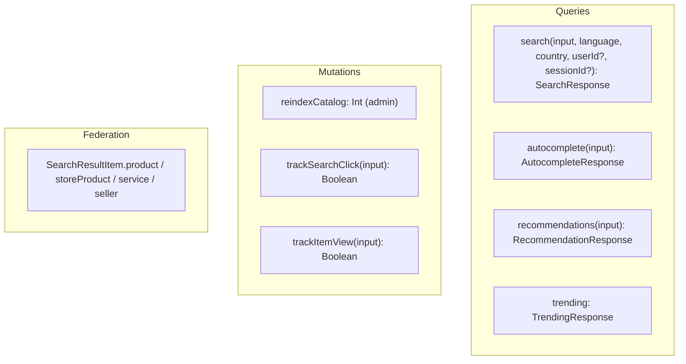

# Features & GraphQL API reference

> **For dummies:** This page is two things. First, a plain list of what the service can do.
> Second, the exact "menu" clients order from — every query and mutation, what you send,
> and what comes back. If you're building a client, this is your reference.

- [Feature overview](#feature-overview)
- [The GraphQL surface at a glance](#the-graphql-surface-at-a-glance)
- [GraphQL API reference](#graphql-api-reference)
  - [Query: search](#query-search)
  - [Query: autocomplete](#query-autocomplete)
  - [Query: recommendations](#query-recommendations)
  - [Query: trending](#query-trending)
  - [Mutation: reindexCatalog](#mutation-reindexcatalog)
  - [Mutation: trackSearchClick](#mutation-tracksearchclick)
  - [Mutation: trackItemView](#mutation-trackitemview)
  - [Federation fields on a hit](#federation-fields-on-a-hit)
- [Types, inputs & enums](#types-inputs--enums)

---

## Feature overview

| Feature | What it does | Backend | Where |
|---------|--------------|---------|-------|
| **Typo‑tolerant search** | Free‑text search across products, store products and services, misspellings included. | Typesense | [search-flow.md](search-flow.md) |
| **Country + language scoping** | Every search is limited to the caller's market and language. | Typesense filters | [search-flow.md](search-flow.md#country--language-scoping) |
| **Own‑listing exclusion** | A seller never sees their own items in results. | `sellerId:!=` filter | [architecture.md](architecture.md#authentication--identity) |
| **Faceted filtering** | Filter by type, category, tags, price, offer, rating; get sidebar counts. | Typesense facets | [typesense.md](typesense.md#faceting) |
| **Sorting** | Relevance, price, newest, rating, popularity. | Typesense `sort_by` | [typesense.md](typesense.md#ranking--typo-tolerance) |
| **Highlighting** | `<mark>`‑style snippets of matched name/description. | Typesense highlight | — |
| **Pagination** | Server‑side, with accurate totals. | Typesense `page`/`per_page` | [search-flow.md](search-flow.md#building-the-response) |
| **Autocomplete** | As‑you‑type suggestions + popular searches. | PostgreSQL `ILIKE` | [search-flow.md](search-flow.md#the-other-queries-autocomplete-recommendations-trending) |
| **Recommendations** | Similar items from a query or recently‑viewed ids. | PostgreSQL | same |
| **Trending** | Hot queries + recent products/services. | PostgreSQL | same |
| **Analytics** | Logs searches, clicks and views. | PostgreSQL | [database.md](database.md#the-tables-this-service-owns) |
| **Federation refs** | Each hit links to its live source entity + seller. | Apollo Federation | [architecture.md](architecture.md#federation-this-is-a-subgraph) |
| **Admin reindex** | Rebuild the whole index on demand. | — | [database.md](database.md#operations--reindex) |
| **Auto‑sync** | Keeps the index fresh every 5 minutes. | Cron | [database.md](database.md#full-reindex-vs-incremental-sync) |
| **Postgres fallback** | Roll back to full‑text search via a flag. | PostgreSQL | [search-flow.md](search-flow.md#the-legacy-postgres-path) |
| **Health & metrics** | `/health` (pings Typesense), `/metrics` (Prometheus). | — | [architecture.md](architecture.md#health--metrics) |

---

## The GraphQL surface at a glance



Endpoint: `POST /graphql` (Playground at `/graphql` when `NODE_ENV !== production`).

---

## GraphQL API reference

### Query: `search`

Typo‑tolerant catalog search, scoped to a market + language.

```graphql
query Search(
  $input: SearchInput!
  $language: Language!
  $country: String!
  $userId: String
  $sessionId: String
) {
  search(
    input: $input
    language: $language
    country: $country
    userId: $userId
    sessionId: $sessionId
  ) {
    searchId
    query
    processingTimeMs
    items {
      id
      type
      name
      description
      price
      offerPrice
      hasOffer
      images
      category
      subcategory
      rating
      reviewCount
      sellerId
      tags
      relevanceScore
      highlightedName
      highlightedDescription
    }
    pageInfo { currentPage pageSize totalItems totalPages hasNextPage hasPreviousPage }
    facets {
      types { name count }
      categories { name count }
      tags { name count }
    }
  }
}
```

**Arguments**

| Arg | Type | Required | Notes |
|-----|------|----------|-------|
| `input` | `SearchInput!` | ✅ | Query + filters + paging + sort (see [below](#input-searchinput)). |
| `language` | `Language!` | ✅ | `ES` \| `EN` \| `FR` \| `PT` \| `DE`. Scopes to items indexed in that language. |
| `country` | `String!` | ✅ | ISO country code, e.g. `"CL"`, `"CA"`. Resolved to a `Country.id`; unknown ⇒ unscoped by country. |
| `userId` | `String` | ❌ | For analytics/history. |
| `sessionId` | `String` | ❌ | For analytics. |

> `x-seller-id` (header, via gateway) is read from context and excludes the caller's own
> listings. It is **not** a GraphQL argument.

**Example variables**

```json
{
  "input": {
    "query": "bicicleta",
    "type": "ALL",
    "page": 1,
    "pageSize": 20,
    "sortBy": "RELEVANCE",
    "minPrice": 0,
    "maxPrice": 500000,
    "categories": ["Bicicletas"],
    "tags": ["urbana"],
    "hasOffer": true,
    "minRating": 4
  },
  "language": "ES",
  "country": "CL",
  "userId": "user-uuid",
  "sessionId": "session-id"
}
```

**Returns** `SearchResponse` — see [types](#object-searchresponse). On the Typesense path,
`suggestions` is `[]` and `correctedQuery` is `null` (typo tolerance replaces "did you
mean").

---

### Query: `autocomplete`

As‑you‑type suggestions. **Runs against PostgreSQL**, not Typesense.

```graphql
query Autocomplete($input: AutocompleteInput!) {
  autocomplete(input: $input) {
    suggestions { text type itemId category score }
    recentSearches
    popularSearches
  }
}
```

| `AutocompleteInput` | Type | Default | Notes |
|---------------------|------|---------|-------|
| `query` | `String!` | — | Partial text. Under 2 chars ⇒ only `popularSearches` returned. |
| `limit` | `Int` | `8` | 1–20. Split between products and services. |
| `type` | `SearchType` | `ALL` | Restrict to products or services. |

**Returns** `AutocompleteResponse`: `suggestions` (matched item names, prefix‑scored),
`recentSearches` (currently always `[]`), `popularSearches` (top queries from the last
30 days).

---

### Query: `recommendations`

Similar items from a query and/or recently‑viewed ids. **PostgreSQL‑backed.**

```graphql
query Recommendations($input: RecommendationInput!) {
  recommendations(input: $input) {
    items { id type name description price images rating reason score }
    basedOn
  }
}
```

| `RecommendationInput` | Type | Default | Notes |
|-----------------------|------|---------|-------|
| `query` | `String` | — | Find items similar to this text. |
| `recentSearches` | `[String!]` | — | Accepted; reserved. |
| `viewedProductIds` | `[Int!]` | — | Recommend by shared category / interests. |
| `viewedServiceIds` | `[Int!]` | — | Recommend by shared subcategory / tags. |
| `limit` | `Int` | `10` | 1–50. |

**Returns** `RecommendationResponse`: `items` (each with a human‑readable `reason` and a
`score`), and `basedOn` describing the signal used. Results are deduplicated by
`type`+`id`.

---

### Query: `trending`

Hot searches and recent items. No arguments. **PostgreSQL‑backed.**

```graphql
query Trending {
  trending {
    searches { query searchCount trendScore }
    products { id type name price images reason score }
    services { id type name price images reason score }
  }
}
```

**Returns** `TrendingResponse`: top 10 queries from the last 7 days (`SearchLog`), plus the
6 most recent active products and services.

---

### Mutation: `reindexCatalog`

**Admin only.** Rebuilds the entire Typesense catalog from PostgreSQL.

```graphql
mutation { reindexCatalog }
```

- Requires the `x-admin-id` header (set by the gateway for an authenticated admin);
  otherwise throws `Unauthorized`.
- Returns the number of documents indexed (`Int`).
- See [database.md → operations](database.md#operations--reindex).

---

### Mutation: `trackSearchClick`

Record that a user clicked a result (feeds relevance analytics + `PopularSearch`).

```graphql
mutation TrackSearchClick($input: TrackSearchClickInput!) {
  trackSearchClick(input: $input)
}
```

| `TrackSearchClickInput` | Type | Required | Notes |
|-------------------------|------|----------|-------|
| `searchId` | `Int!` | ✅ | The `searchId` from the `search` response. |
| `itemId` | `Int!` | ✅ | Clicked item id. |
| `itemType` | `String!` | ✅ | `"PRODUCT"` \| `"STORE_PRODUCT"` \| `"SERVICE"`. |
| `position` | `Int!` | ✅ | 1‑based position in results. |
| `userId` | `String` | ❌ | Optional. |

**Returns** `Boolean` (`true` on success; `false` is swallowed on error — never throws).

---

### Mutation: `trackItemView`

Record an item detail view (increments the item's `viewCount`).

```graphql
mutation TrackItemView($input: TrackItemViewInput!) {
  trackItemView(input: $input)
}
```

| `TrackItemViewInput` | Type | Required | Notes |
|----------------------|------|----------|-------|
| `itemId` | `Int!` | ✅ | Viewed item id. |
| `itemType` | `String!` | ✅ | `"PRODUCT"` \| `"STORE_PRODUCT"` \| `"SERVICE"` — selects which table's `viewCount` is bumped. |
| `userId` | `String` | ❌ | Optional. |
| `sessionId` | `String` | ❌ | Optional. |
| `duration` | `Int` | ❌ | Seconds spent viewing (≥ 0). |
| `source` | `String` | ❌ | e.g. `"search"`, `"recommendation"`, `"direct"`. |

**Returns** `Boolean`.

---

### Federation fields on a hit

Every `SearchResultItem` exposes typed references the gateway resolves against the owning
subgraphs. Exactly one of the item refs is non‑null (by `type`); `seller` is present when
the hit has a `sellerId`.

```graphql
query {
  search(input: { query: "mesa" }, language: ES, country: "CL") {
    items {
      id
      type
      name
      product { id }        # non-null only when type = PRODUCT
      storeProduct { id }   # non-null only when type = STORE_PRODUCT
      service { id }        # non-null only when type = SERVICE
      seller { id }         # non-null when the hit has a sellerId
    }
  }
}
```

Through these, a client can select **any** field the marketplace / stores / services /
seller subgraphs expose (stock, condition, environmental impact, seller profile…) and get
**live** values — none of which are stored in the index. See
[architecture.md → federation](architecture.md#federation-this-is-a-subgraph).

---

## Types, inputs & enums

### Input: `SearchInput`

| Field | Type | Default | Validation | Meaning |
|-------|------|---------|-----------|---------|
| `query` | `String!` | — | — | Search text (`*`/all when empty). |
| `type` | `SearchType` | `ALL` | — | `ALL` \| `PRODUCTS` \| `SERVICES`. |
| `page` | `Int` | `1` | ≥ 1 | 1‑based page. |
| `pageSize` | `Int` | `20` | 1–100 | Results per page. |
| `sortBy` | `SearchSortBy` | `RELEVANCE` | — | Sort order. |
| `minPrice` | `Float` | — | — | Lower price bound. |
| `maxPrice` | `Float` | — | — | Upper price bound. |
| `categories` | `[String!]` | — | — | Category name filter (Typesense path only). |
| `tags` | `[String!]` | — | — | Tag filter (Typesense path only). |
| `hasOffer` | `Boolean` | — | — | Only items with an offer. |
| `minRating` | `Float` | — | 0–5 | Minimum rating. |

### Object: `SearchResponse`

| Field | Type | Notes |
|-------|------|-------|
| `searchId` | `Int` | Pass to `trackSearchClick`. |
| `items` | `[SearchResultItem!]!` | The page of hits. |
| `pageInfo` | `SearchPageInfo!` | Pagination metadata. |
| `facets` | `SearchFacets` | Sidebar counts. |
| `query` | `String!` | Echo of the query. |
| `processingTimeMs` | `Int!` | Server processing time. |
| `suggestions` | `[String!]` | `[]` on the Typesense path. |
| `correctedQuery` | `String` | `null` on the Typesense path. |

### Object: `SearchResultItem`

`id`, `type` (`SearchResultType`), `name`, `description`, `price`, `offerPrice`,
`hasOffer`, `images`, `category`, `subcategory`, `rating`, `reviewCount`, `sellerId`,
`sellerName`, `tags`, `relevanceScore`, `highlightedName`, `highlightedDescription`, plus
the federation fields `product` / `storeProduct` / `service` / `seller`.

### Object: `SearchPageInfo`

`currentPage`, `pageSize`, `totalItems`, `totalPages`, `hasNextPage`, `hasPreviousPage`.

### Object: `SearchFacets` / `SearchFacet`

`SearchFacets` has `types`, `categories`, `tags` (and `priceRanges`, populated only by the
Postgres path). Each is a list of `SearchFacet { name: String!, count: Int! }`.

### Other response objects

- **`AutocompleteResponse`** → `suggestions: [AutocompleteItem!]!`, `recentSearches:
  [String!]!`, `popularSearches: [String!]!`. `AutocompleteItem { text, type, itemId,
  category, score }`.
- **`RecommendationResponse`** → `items: [RecommendationItem!]!`, `basedOn: String`.
  `RecommendationItem { id, type, name, description, price, images, rating, reason, score }`.
- **`TrendingResponse`** → `searches: [TrendingSearch!]!`, `products: [RecommendationItem!]!`,
  `services: [RecommendationItem!]!`. `TrendingSearch { query, searchCount, trendScore }`.

### Enums

| Enum | Values |
|------|--------|
| `SearchType` | `ALL`, `PRODUCTS`, `SERVICES` |
| `SearchSortBy` | `RELEVANCE`, `PRICE_ASC`, `PRICE_DESC`, `NEWEST`, `RATING`, `POPULARITY` |
| `SearchResultType` | `PRODUCT`, `STORE_PRODUCT`, `SERVICE` |
| `Language` | `ES`, `EN`, `FR`, `PT`, `DE` (only `ES`/`EN`/`FR` are indexed today) |

---

**Back to:** [README](../README.md) · [Architecture](architecture.md) ·
[Typesense](typesense.md) · [Database](database.md) · [Search flow](search-flow.md) ·
[Configuration](configuration.md) · [Extending](extending.md)
