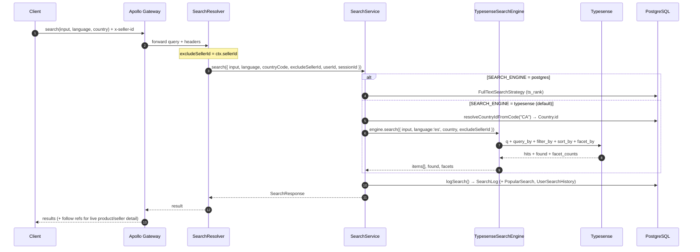
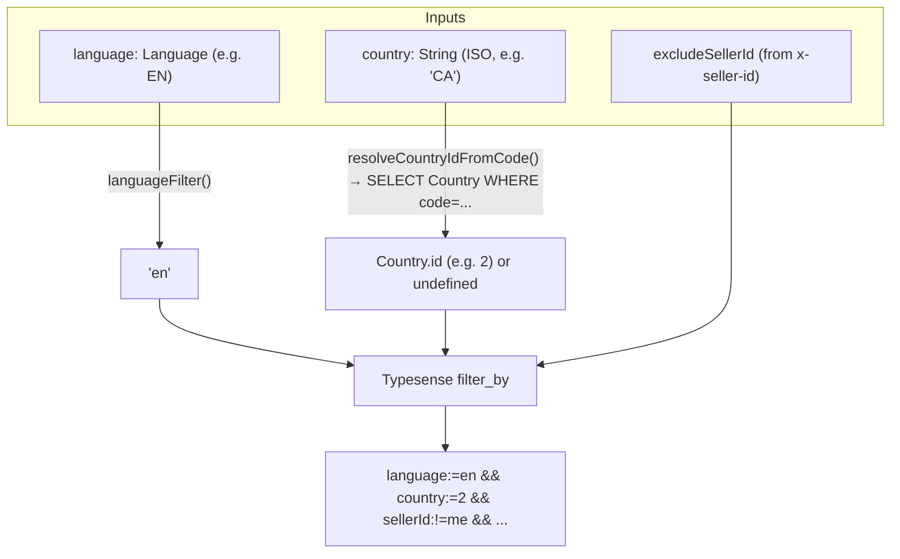
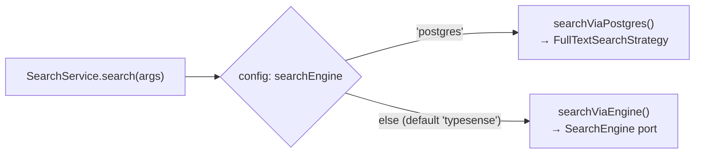
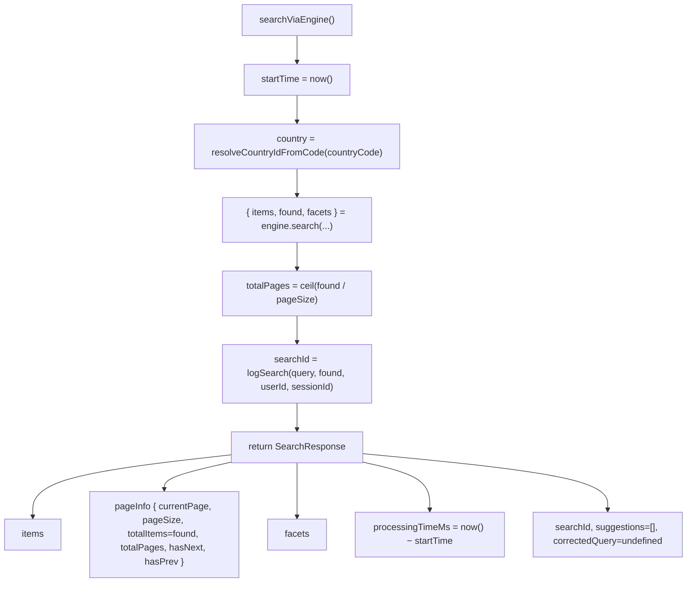
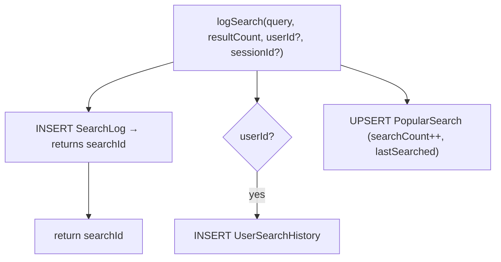
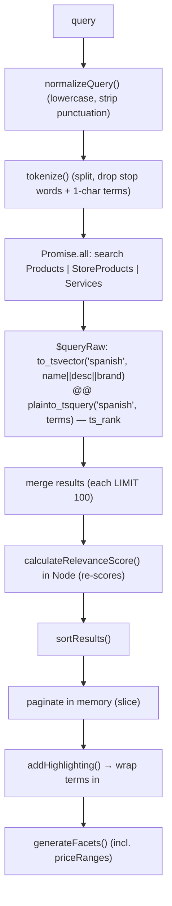
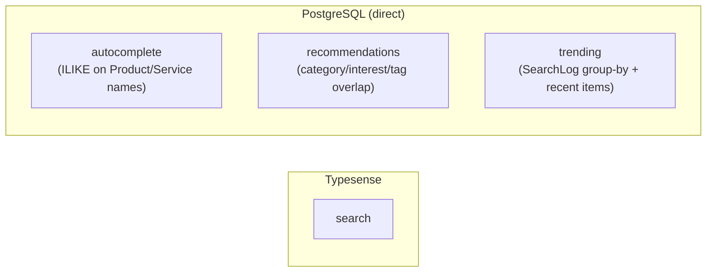

# Search Flow — how a search is actually done

> **For dummies:** When you type in the search box, your query travels: client → gateway →
> this service → Typesense → back. Along the way this service figures out *which country
> and language* you're shopping in, hides your own listings, asks Typesense for the best
> matches, writes a note in the analytics log, and hands back a page of results plus the
> sidebar filter counts. This page walks that journey step by step.

- [End-to-end sequence](#end-to-end-sequence)
- [The entry point](#the-entry-point)
- [Country & language scoping](#country--language-scoping)
- [Engine vs Postgres routing](#engine-vs-postgres-routing)
- [Building the response](#building-the-response)
- [Analytics logging](#analytics-logging)
- [The legacy Postgres path](#the-legacy-postgres-path)
- [The other queries](#the-other-queries-autocomplete-recommendations-trending)

---

## End-to-end sequence



---

## The entry point

[`SearchResolver.search`](../src/search/search.resolver.ts) is the GraphQL entry. Its
signature is the contract with clients:

```graphql
search(
  input: SearchInput!,      # query + filters + paging + sort
  language: Language!,      # ES | EN | FR | PT | DE  (required)
  country: String!,         # ISO country code, e.g. "CL", "CA"  (required)
  userId: String,           # optional, for analytics
  sessionId: String         # optional, for analytics
): SearchResponse!
```

Key points:

- **`language` and `country` are required arguments**, supplied by both web and mobile
  clients. Together they scope every search. (Sending them as arguments, not headers, means
  web and mobile use the exact same mechanism.)
- **`ctx.sellerId`** comes from the `x-seller-id` header (set by the gateway). It's passed
  down as `excludeSellerId` — used only to hide the caller's own listings. It does **not**
  decide the market.

The resolver does almost nothing itself; it forwards to `SearchService.search(...)`.

---

## Country & language scoping

This is the heart of "which items can I see". Both are turned into Typesense filters:



- **`language`** — `languageFilter()` lowercases the enum (`EN → 'en'`). Applied on
  **every** query as `language:=<lang>`. If a client somehow omits it, the code defaults to
  `es`, but the GraphQL arg is non‑null so clients always send it.
- **`country`** — `resolveCountryIdFromCode()` runs
  `SELECT id FROM "Country" WHERE code = <upper(code)>` to turn the ISO code into the
  numeric `Country.id` that documents are indexed with.
  - If the code is **unknown/missing**, it resolves to `undefined` and the `country` filter
    is **omitted** — results then span all countries rather than returning nothing. (This is
    also the state before the `Country.code` column is backfilled.)
- **`excludeSellerId`** — when present, adds `sellerId:!=<caller>` so you never see your own
  items in your results.

The actual clause assembly happens in the engine's `buildFilterBy()` — see
[typesense.md → filter_by construction](typesense.md#filter_by-construction).

---

## Engine vs Postgres routing

`SearchService.search()` picks the backend from the `SEARCH_ENGINE` config value:



- **Default (`typesense`)** → `searchViaEngine()`. This is the production path.
- **`postgres`** → `searchViaPostgres()`, the legacy full‑text path, kept for rollback.

Both return the **same** `SearchResponse` shape, so clients can't tell which ran.

---

## Building the response

`searchViaEngine()` assembles the final `SearchResponse`:



- **Pagination** is done by **Typesense** (`page` / `per_page`), so `found` is the true
  total across all pages — `totalPages`, `hasNextPage`, `hasPreviousPage` are computed from
  it. (Contrast the Postgres path, which paginates in memory after a `LIMIT 100` per
  source.)
- **`suggestions`** is always `[]` and **`correctedQuery`** always `undefined` on the
  Typesense path — typo tolerance makes in‑flow "did you mean" generation unnecessary, so
  the old (broken) suggestion step was removed.

---

## Analytics logging

Every search calls `logSearch()`, which best‑effort writes to up to three tables and
returns the `searchId` (so the client can later report a click):



It's wrapped in try/catch and returns `null` on failure — analytics never breaks a search.
Clicks and views are recorded separately by the `trackSearchClick` / `trackItemView`
mutations. Full analytics model reference in [database.md](database.md#the-tables-this-service-owns).

---

## The legacy Postgres path

`SEARCH_ENGINE=postgres` routes to `searchViaPostgres()`, which uses
[`FullTextSearchStrategy`](../src/search/strategies/fulltext-search.strategy.ts). It's a
different algorithm, kept only for rollback:



Differences from the Typesense path worth knowing:

| | Typesense path | Postgres path |
|-|----------------|---------------|
| Typo tolerance | ✅ built‑in | ❌ (`spellCheck()` is a no‑op) |
| Language | filter by `es`/`en`/`fr` | hardcoded `'spanish'` |
| Country scope | ✅ `country` filter | ❌ not applied |
| Totals | exact (`found`) | capped (~100/source, counted in memory) |
| Facets | `type/category/tags` | `categories/types/tags/priceRanges` |
| `categories`/`tags` filters | applied | **not** applied |

> Treat the Postgres path as an emergency brake, not a feature‑equal alternative.

---

## The other queries (autocomplete, recommendations, trending)

Only `search` uses Typesense. **Autocomplete, recommendations and trending still query
PostgreSQL directly** (they were intentionally left unchanged). Keep this in mind: they
don't benefit from typo tolerance or the country/language filters.



- **`autocomplete`** — `ILIKE '%query%'` against `Product`/`Service` names (and brand/tags),
  scored by prefix match; falls back to `popularSearches` from `SearchLog` for very short
  queries.
- **`recommendations`** — finds items similar to a query, or to recently‑viewed
  product/service ids (by shared category / interests / tags), then dedupes.
- **`trending`** — top queries from the last 7 days of `SearchLog`, plus the 6 most recent
  active products and services.

For the exact inputs/outputs of each, see [features.md](features.md#graphql-api-reference).

---

**Next:** [Configuration (.env) →](configuration.md)
