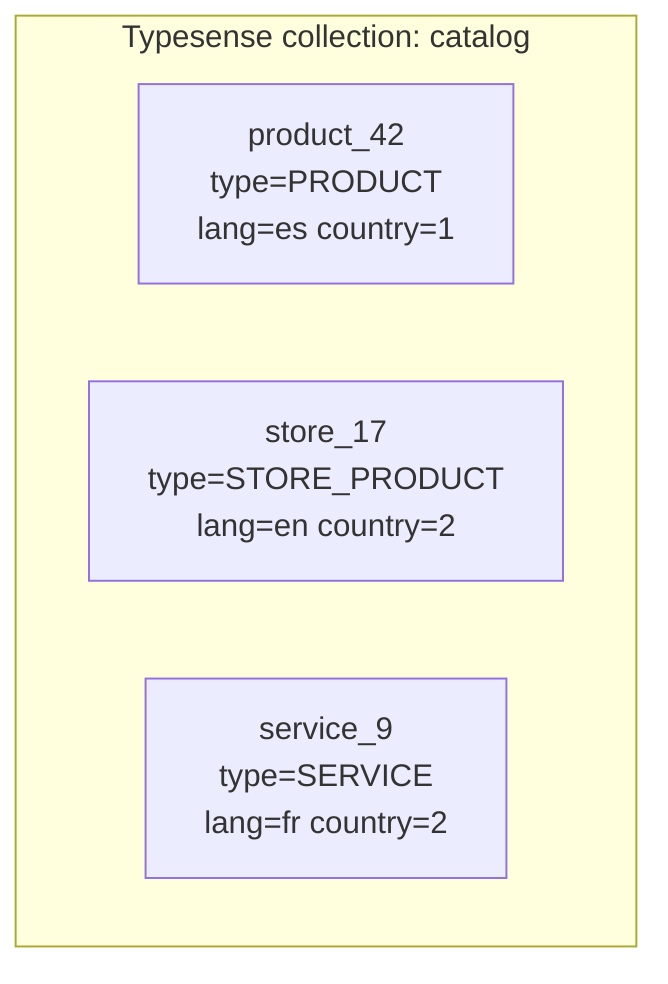
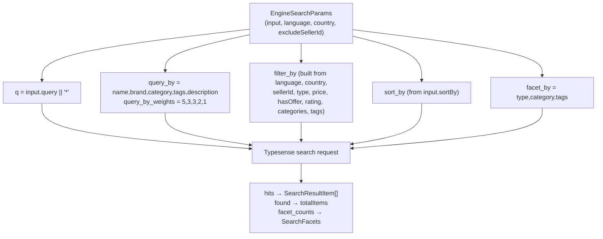
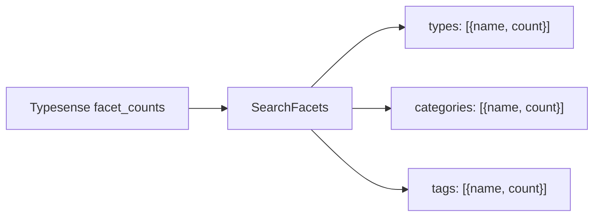
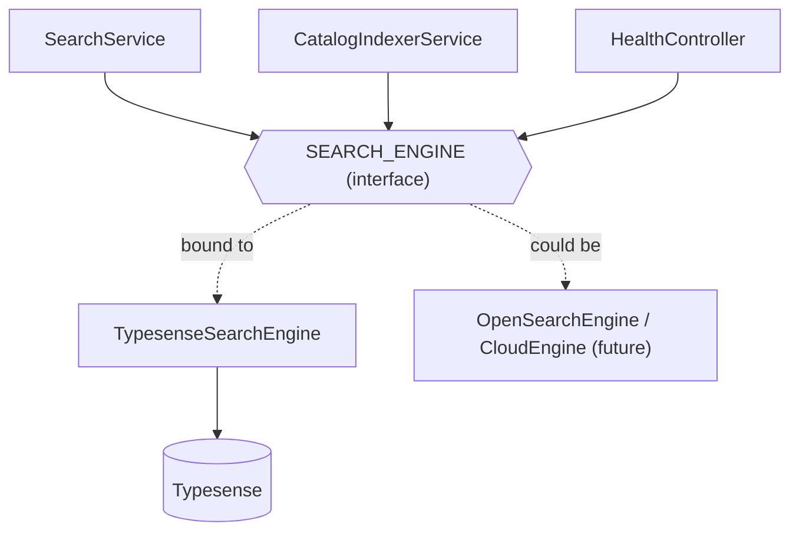

# Typesense — how the search engine works

> **For dummies:** Typesense is a specialized database built for *one* job: finding text
> fast, even when it's misspelled. We give it a stack of "documents" (one per catalog
> item, like an index card) and it builds an inverted index. When someone searches, it
> returns the best‑matching cards in a few milliseconds, ranked by relevance, and it
> tolerates typos automatically. We run it as a Docker container next to this service.

- [What is Typesense?](#what-is-typesense)
- [The single `catalog` collection](#the-single-catalog-collection)
- [The document shape](#the-document-shape)
- [How a query is built](#how-a-query-is-built)
- [Ranking & typo tolerance](#ranking--typo-tolerance)
- [Faceting](#faceting)
- [The engine port (swappability)](#the-engine-port-swappability)
- [The client & connection](#the-client--connection)
- [Failure modes](#failure-modes)
- [Why Typesense (and not Postgres FTS / Elasticsearch)](#why-typesense-and-not-postgres-fts--elasticsearch)

---

## What is Typesense?

[Typesense](https://typesense.org/) is an open‑source, typo‑tolerant search engine — a
lighter alternative to Elasticsearch/Algolia. You define **collections** (like tables)
with a typed **schema**, push **documents** (like rows) into them, and run **search
requests** that return ranked hits with highlighting and facet counts.

In this project it's:

- **Self‑hosted** locally via [`docker-compose.yml`](../docker-compose.yml) (image
  `typesense/typesense:27.1`, port `8108`, data in a Docker volume).
- Talked to from Node with the official `typesense` npm client, wrapped by
  [`TypesenseSearchEngine`](../src/search/engine/typesense.engine.ts).
- Entirely **config‑driven** (`TYPESENSE_*` env vars), so switching to Typesense Cloud is
  just an env change — see [configuration.md](configuration.md).

---

## The single `catalog` collection

All three catalog types — **marketplace products**, **store products** and **services** —
live together in **one** collection named `catalog`
([`locale.config.ts`](../src/search/indexer/locale.config.ts)).



Two design decisions to understand:

1. **One collection, not one per type.** Products, store products and services share the
   same fields for searching (name, description, price, category…), so they coexist. The
   `type` field distinguishes them and is used both to filter (`type: PRODUCTS` →
   `[PRODUCT, STORE_PRODUCT]`) and to attach the correct federation reference.

2. **One collection, not one per language/market.** Every document carries a `language`
   and a `country` field. Scoping to a market is done with **filters at query time**, not
   by routing to separate collections. This is what lets a bilingual market like Canada
   (English **and** French items) live in one place — the query just filters
   `language:=en` or `language:=fr`.

To avoid id collisions between the three sources, each document's `id` is **namespaced**:
`product_<id>`, `store_<id>`, `service_<id>`. The original numeric id is preserved
separately as `entityId`.

---

## The document shape

The `CatalogDocument` interface
([`search-engine.interface.ts`](../src/search/engine/search-engine.interface.ts)) defines
what one indexed item looks like. The Typesense **collection schema** is declared in
`TypesenseSearchEngine.schema()`:

| Field | Type | Indexed? | Facet? | Notes |
|-------|------|----------|--------|-------|
| `id` | string | (id) | — | Namespaced: `product_<id>` / `store_<id>` / `service_<id>`. |
| `entityId` | int64 | ✅ | — | The original numeric row id (returned to clients as `id`). |
| `type` | string | ✅ | ✅ | `PRODUCT` \| `STORE_PRODUCT` \| `SERVICE`. |
| `name` | string | ✅ | — | Primary searchable text (highest weight). |
| `description` | string | ✅ (optional) | — | Searchable, lowest weight. |
| `brand` | string | ✅ (optional) | — | Searchable. |
| `category` | string | ✅ (optional) | ✅ | Translated category name (Spanish at index time). |
| `subcategory` | string | ✅ (optional) | — | Not searched, but returned. |
| `tags` | string[] | ✅ (optional) | ✅ | Searchable + facetable. |
| `images` | string[] | ❌ (`index:false`) | — | Stored for display only. |
| `price` | float | ✅ (optional) | — | Range‑filterable / sortable. |
| `offerPrice` | float | ✅ (optional) | — | Store products only. |
| `hasOffer` | bool | ✅ | ✅ | |
| `rating` | float | ✅ (optional) | — | Filter (`minRating`) + sort. |
| `reviewCount` | int32 | ✅ (optional) | — | Sort (`POPULARITY`). |
| `sellerId` | string | ✅ (optional) | ✅ | Used to **exclude** the caller's own items. |
| `country` | int32 | ✅ (optional) | ✅ | Market scope (a `Country.id`). |
| `language` | string | ✅ | ✅ | `es` \| `en` \| `fr` — scoping filter. |
| `createdAt` | int64 | ✅ | — | Unix seconds. **`default_sorting_field`** + `NEWEST` sort. |

> **Where do the values come from?** The indexer reads them from PostgreSQL and maps them.
> `language` and `country` are derived from the item's **seller**. That mapping is covered
> in [database.md](database.md#from-a-row-to-a-document).

---

## How a query is built

Every field you can pass in `SearchInput` becomes part of one Typesense search request.
`TypesenseSearchEngine.search()` assembles it:



### The pieces

- **`q`** — the raw query text, trimmed. An empty query becomes `*` (browse/return
  everything that matches the filters).
- **`query_by` / `query_by_weights`** — which fields are matched, and how much each
  counts. Highest to lowest: **`name` (5) → `brand` (3) → `category` (3) → `tags` (2) →
  `description` (1)**. A hit in the name ranks far above a hit buried in the description.
- **`filter_by`** — hard constraints, `&&`‑joined (details below).
- **`sort_by`** — see [Ranking](#ranking--typo-tolerance).
- **`facet_by`** — `type,category,tags`, with `max_facet_values: 20`.
- **`highlight_full_fields`** — `name,description`, so hits come back with `<mark>`‑style
  snippets.
- **`page` / `per_page`** — server‑side pagination (`per_page = pageSize`).

### `filter_by` construction

`buildFilterBy()` assembles clauses in this order:

| Clause | When | Example |
|--------|------|---------|
| `language:=<lang>` | **always** | `language:=es` |
| `country:=<id>` | when the country code resolved | `country:=2` |
| `sellerId:!=<caller>` | authenticated caller | `sellerId:!=abc` |
| `type:[PRODUCT,STORE_PRODUCT]` / `type:=SERVICE` | `input.type` is `PRODUCTS` / `SERVICES` | — |
| `price:>=` / `price:<=` | `minPrice` / `maxPrice` | `price:>=1000` |
| `hasOffer:=<bool>` | `hasOffer` set | `hasOffer:=true` |
| `rating:>=<n>` | `minRating` set | `rating:>=4` |
| `category:[…]` | `categories` set | `category:[Bikes]` |
| `tags:[…]` | `tags` set | `tags:[vintage]` |

String values (language, sellerId, category, tags) are wrapped in **backticks** by
`quote()` before being placed in the clause, so special characters are safe — e.g. the
`language` clause is really `` language:=`es` ``.

> **Note:** `language` is always applied, but `country` is **omitted** if the client's
> country code didn't resolve to an id — in that case results span all countries rather
> than silently returning nothing. See
> [search-flow.md](search-flow.md#country--language-scoping).

---

## Ranking & typo tolerance

**Typo tolerance is on by default** — this is the headline reason we use Typesense.
Searching `bicecleta` still finds `bicicleta`; the engine matches within an edit distance
automatically, no configuration needed.

**Ranking** is controlled by `sort_by`, mapped from the `SearchSortBy` enum in
`buildSortBy()`:

| `SearchSortBy` | Typesense `sort_by` |
|----------------|---------------------|
| `RELEVANCE` (default) | `_text_match:desc, createdAt:desc` |
| `PRICE_ASC` | `price:asc` |
| `PRICE_DESC` | `price:desc` |
| `NEWEST` | `createdAt:desc` |
| `RATING` | `rating:desc` |
| `POPULARITY` | `reviewCount:desc` |

For **relevance**, Typesense computes an internal `_text_match` score (combining which
field matched, its weight, proximity, and typo distance), and we break ties by recency.
The per‑hit score is surfaced to clients as `relevanceScore` (`hit.text_match`).

---

## Faceting

Facets are the "filter by…" counts you show in a sidebar. The request asks for
`facet_by: 'type,category,tags'`, and `toFacets()` reshapes Typesense's `facet_counts`
into the GraphQL `SearchFacets` type:



Each entry is `{ name, count }`, e.g. `categories: [{ name: "Bikes", count: 42 }]`.

> `priceRanges` exists on the `SearchFacets` type but is only populated by the **Postgres
> fallback** path; the Typesense path returns `type`, `category` and `tags` facets.

---

## The engine port (swappability)

Nothing outside `engine/` knows Typesense exists. Callers depend on the **`SearchEngine`
interface** ([`search-engine.interface.ts`](../src/search/engine/search-engine.interface.ts)),
injected via the `SEARCH_ENGINE` token:



The interface is small:

```ts
interface SearchEngine {
  ensureCollections(): Promise<void>;          // create the catalog collection if missing
  indexDocuments(docs: CatalogDocument[]): Promise<void>;  // upsert
  deleteDocuments(ids: string[]): Promise<void>;           // evict by namespaced id
  search(params: EngineSearchParams): Promise<EngineSearchResult>;
  health(): Promise<boolean>;                  // liveness for /health
}
```

To move to a different engine you write **one** class implementing this interface and
change the binding in [`search.module.ts`](../src/search/search.module.ts). No resolver,
service, or GraphQL type changes. See
[extending.md → swap the engine](extending.md#recipe-swap-the-search-engine).

---

## The client & connection

The Typesense client is constructed once in the `TypesenseSearchEngine` constructor from
config:

```ts
new Client({
  nodes: [{ host: TYPESENSE_HOST, port: TYPESENSE_PORT, protocol: TYPESENSE_PROTOCOL }],
  apiKey: TYPESENSE_API_KEY,
  connectionTimeoutSeconds: TYPESENSE_TIMEOUT,
});
```

Defaults (local dev): `localhost:8108`, `http`, key `dev-typesense-key`, timeout `5s`. The
**API key must match** the one the Typesense server was started with. For Typesense Cloud,
point `TYPESENSE_HOST` at `<cluster>.typesense.net`, `TYPESENSE_PROTOCOL=https`,
`TYPESENSE_PORT=443`.

---

## Failure modes

The engine degrades gracefully in one important case and fails loudly in the rest:

| Situation | Behaviour |
|-----------|-----------|
| Collection doesn't exist yet (never indexed) | `search()` catches `ObjectNotFound`, logs a warning, and returns **empty results** so the federated query still succeeds. Fix: run a reindex. |
| Some documents fail to import | `indexDocuments()` logs an `ImportError` and rethrows. |
| Typesense down / auth wrong | Any other error **propagates** (the search fails); `/health` reports `typesense: "unavailable"`. |

> The collection is created only by a **reindex** or the **sync cron** (via
> `ensureCollections()`), never by a search query. A fresh environment must be indexed
> once. See [database.md → operations](database.md#operations--reindex).

---

## Why Typesense (and not Postgres FTS / Elasticsearch)?

| Option | Verdict |
|--------|---------|
| **PostgreSQL full‑text** (the original approach, still the fallback) | No typo tolerance, needs GIN indexes to scale, language hardcoded to `spanish`, filters/facets done in app memory after a `LIMIT`. Kept behind `SEARCH_ENGINE=postgres` for rollback only. |
| **Elasticsearch / OpenSearch** | Powerful but heavy to run and operate; more moving parts than this catalog needs today. Still possible later — the engine port keeps the door open. |
| **Typesense** ✅ | Lightweight single binary, typo tolerance out of the box, simple typed schema, fast, and cloud‑portable. Fits a marketplace catalog well. |

---

**Next:** [How it's linked to the database →](database.md)
